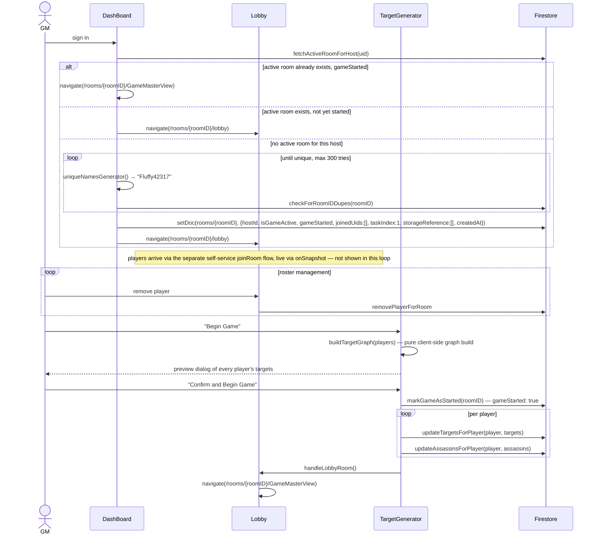
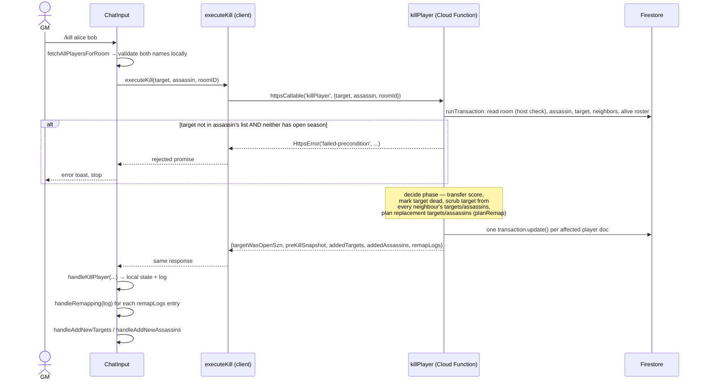
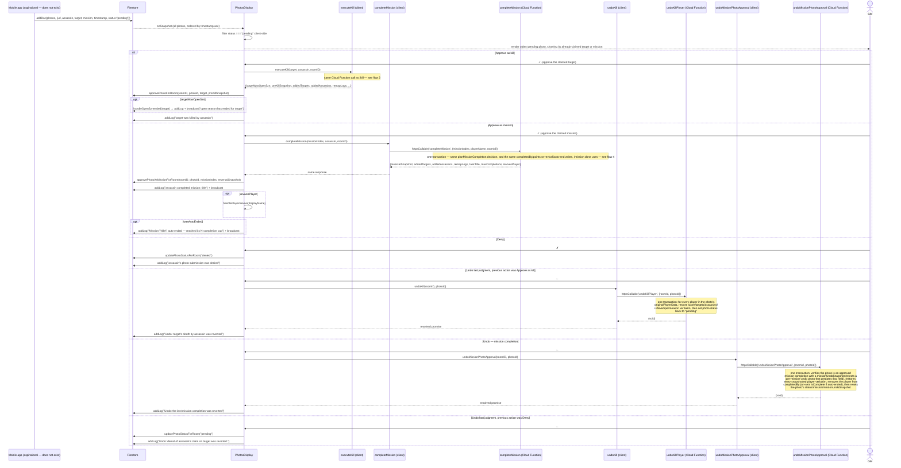
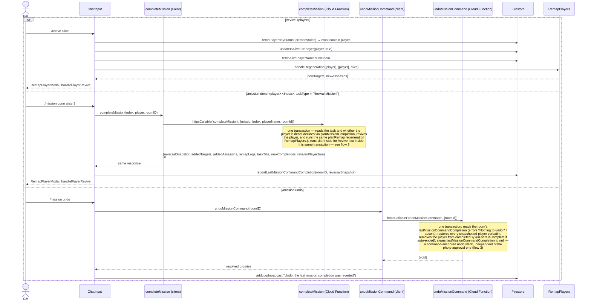
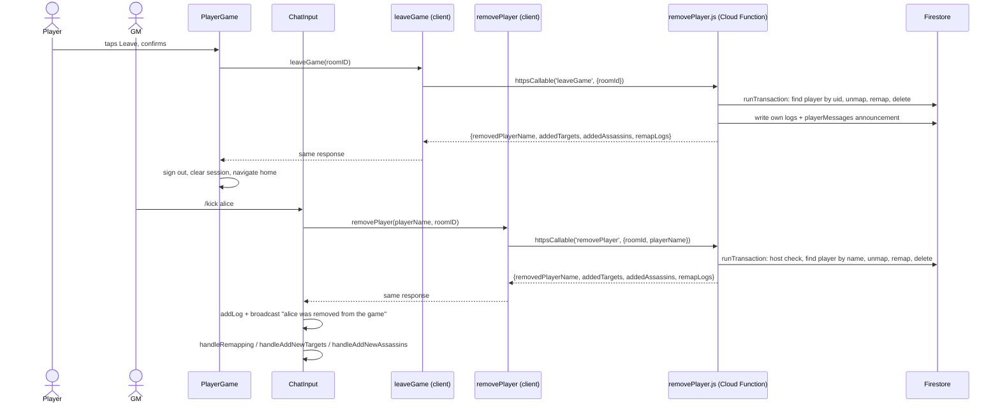
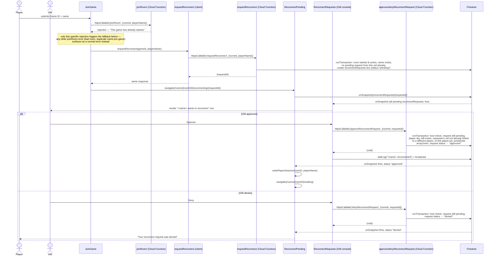

# Game flows

Sequence diagrams for the four flows that matter. Killing a player (flow 2),
completing a mission and its undo (flows 3 and 4), and kill-undo (flow 3) all
run server-side, inside a Cloud Function (`improvements.md` item 4,
docs/superpowers/specs/2026-08-29-mission-undo-design.md); everything else
shown still runs in the browser.

---

## 1. Hosting a room and starting a game



Two things to note:

- The guard is `arrayOfPlayers.length <= 1`, so a game can start with two
  players — `maxTargetsFor` (below) clamps each player's target count down
  for a small roster rather than refusing to start.
- `GameMasterView` no longer receives the roster via router state — it
  subscribes live via `onSnapshot` (`docs/improvements.md` item 13), so a
  reload no longer loses it.

### The target assignment algorithm

`buildTargetGraph` (`src/game/targetGraph.js`) builds the graph like this:

```
maxTargetsFor(playerCount) = clamp(playerCount > 15 ? 3 : playerCount > 5 ? 2 : 1, 0, playerCount - 1)

shuffle the roster (Fisher–Yates/Durstenfeld, on a copy)
lay the shuffled roster out in a ring
for each player P at ring position i:
    for step in 1..maxTargets:
        P hunts the player at ring position (i + step) % count
```

This is a true ring construction, not a search: every player gets exactly
`maxTargets` targets and `maxTargets` assassins, by construction, with no
self-targeting and (whenever `2 * maxTargets < playerCount`) no mutual
pairs. `TargetGenerator.js` and `ResetTargetsButton.js` both call this
same shared function — it replaced two ~120-line duplicate
implementations, plus a differently-shaped third copy in `RemapPlayers.js`
(`docs/improvements.md` item 11).

It replaced `TargetGenerator.InitializeTargets`, a randomized ring-walk
that could abandon a slot when its search wrapped all the way around,
leaving players with fewer than `MAXTARGETS` targets and a graph that
could fracture into disjoint sub-games — and `randomizeArray`, a subtly
incorrect Fisher–Yates that iterated forward while drawing `j` from
`[0, i]`, which does not produce a uniform permutation
(`docs/improvements.md` item 12).

`functions/callableFunctions/killPlayer.js` and `joinRoom.js` also depend
on this file, via a vendored copy — see "Keeping the Cloud Functions
self-contained" below.

---

## 2. Killing a player (`/kill target assassin`)

Resolved by `improvements.md` item 4. What used to be ~15 sequential,
unbatched Firestore round trips from the browser is now a single
`httpsCallable` request to a Cloud Function, `killPlayer`, which does
everything inside one Firestore transaction.



**Scoring.** The assassin receives the victim's _entire_ score (floored at 0),
and the victim's score is zeroed. Since everyone starts at 10, points concentrate
as the game progresses. Unchanged by item 4 — only where it runs changed.

**Open season.** The three-way rule is: the target is on the assassin's list,
OR the target has open season on themself, OR the assassin has open season
(blanket rights). `killPlayer` reads both `assassinData.openSeason` and
`targetData.openSeason` directly inside the transaction — the confusing
assassin/victim mixup the old client code had (checking the assassin's flag
but logging as if it were the victim's) is gone along with the code that had
it, since `targetWasOpenSzn` returned to the client is always read from the
target's own document.

**Atomicity.** No longer independent writes — either the whole transaction
lands (score transfer, victim marked dead, every neighbour unmapped, every
orphaned player remapped) or none of it does. A network failure partway
through can no longer leave the target graph half-repaired.

### Remapping

Folded into the same transaction as the kill itself, not a separate
client-driven step. `killPlayer` calls the same pure `planRemap`
(`src/game/remapPlan.js`) the old `RemapPlayers.handleRegeneration` used,
but against an in-memory roster read once in the transaction's read phase
(with the about-to-die target filtered out and scrubbed from every
neighbour's arrays, since a transaction's writes haven't landed yet when the
roster is read) rather than one Firestore document fetched per candidate.

`RemapPlayers.js` itself still exists and is still used for `/revive` — see
flow 4 — where the same one-write-at-a-time caveat described in
`improvements.md` item 17 still applies.

### Keeping the Cloud Functions self-contained

`killPlayer.js` requires `../vendor/game/remapPlan` and
`../vendor/game/playerNames`; `joinRoom.js` requires
`../vendor/game/playerNames`. Neither requires `../vendor/game/targetGraph`
directly — `remapPlan.js` itself requires it, so it's vendored
transitively for `killPlayer.js`'s sake. All three are vendored rather
than reaching into `src/game/` directly. Firebase's functions deploy uploads
only the `functions/` directory in isolation, so a `require()` reaching
outside it resolves fine locally and under the emulator (both run from
the full repo checkout) but cannot resolve in the actual deployed bundle.
`functions/scripts/sync-shared-game-logic.js` copies the specific
`src/game/` modules these two functions depend on into the gitignored
`functions/vendor/game/` — run automatically before every deploy
(`firebase.json`'s `functions[0].predeploy`) and before
`npm run test:emulator`, which exercises the same require paths the real
deploy uses. `src/game/` stays the single source of truth;
`functions/vendor/` is a regenerated build artifact, never hand-edited or
committed.

---

## 3. Photo moderation

The mobile app writes a `pending` photo; the GM judges it from the console.
**Aspirational** — no such app exists yet (`improvements.md` item 33), so
this flow has no way to start today except manual/emulator seeding of a
`photos` document.



**The target/mission claim now comes from the photo document itself, set
by the player at submission time, not picked by the GM at approval time**
(`docs/superpowers/specs/2026-09-02-player-selects-target-mission-design.md`).
`PhotosDisplay` no longer computes any options or shows a picker — it
reads `target`/`mission` straight off the current photo and displays them
("assassin's kill attempt on target" / "assassin's mission attempt:
title"). Approve calls `executeKill`/`completeMission` with those
already-known values; both still independently re-validate the claim
against live game state exactly as they did before, so a claim that's
gone stale by review time still fails cleanly rather than being approved
anyway.

`PhotosDisplay` calls the exact same `executeKill` (and therefore the same
`killPlayer` Cloud Function) `/kill` does — resolved by `improvements.md`
item 5, then item 4 moved what `executeKill` does server-side. This closed
what used to be two real gaps between the photo-approval path and `/kill`:
approving a photo now validates the target the same way `/kill` does, and now
remaps orphaned players the same way `/kill` does, since both call the same
function. `preKillSnapshot` — a map keyed by normalized player name, each
value `{score, targets, assassins, isAlive, openSeason}`, one entry per
player `killPlayer`'s transaction touched (target, killer, and anyone the
remap reassigned) — is persisted onto the photo document itself
(`approvePhotoForRoom`) rather than kept only in React state, which is what
makes Undo survive a reload (`improvements.md` item 6).

**Open-season-ended announcement.** `killPlayer` always clears
`openSeason` server-side inside its own transaction when the killed target
had it set, regardless of which path triggered the kill. `PhotosDisplay`'s
`handlePass` reads `targetWasOpenSzn` back from `executeKill`'s response
and, when true, calls `handleOpenSznended(target)` before announcing the
kill itself — the same GM-console log/broadcast pair
(`'open season has ended for <target>'`) the typed `/kill` command already
triggers via `GameMasterView.js`'s own `handleOpenSznended` call. Before
this, the photo-approval path silently ended open season without ever
telling anyone.

Approving a photo as a mission instead of a kill calls the exact same
server-side `completeMission` Cloud Function (and, underneath it, the same
`planMissionCompletion` decision logic) that `/mission done` calls — see flow
4 — so a mission completion behaves identically no matter which of the two
paths triggered it, and each caller persists its own `reversalSnapshot` for
later undo (docs/superpowers/specs/2026-08-27-mission-completion-via-photo-design.md,
docs/superpowers/specs/2026-08-29-mission-undo-design.md). Undoing a
mission-approved photo is likewise a single atomic Cloud Function call —
`undoMissionPhotoApproval` — mirroring how `undoKillPlayer` already undoes
an approved kill; it is a photo-anchored undo stack, entirely independent
of `/mission undo`'s own stack (flow 4).

**Undoing an approval no longer replays individual client writes.** The
2026-08-16 full-kill-undo redesign
(`docs/superpowers/specs/2026-08-16-full-kill-undo-design.md`) replaced the
old five-write sequence (`updatePhotoStatusForRoom` + `handlePlayerRevive` +
`remapPlayerAsTarget`, run one at a time from the browser, which only ever
reverted the target's own side of the kill) with a single atomic
`undoKillPlayer` Cloud Function call: it resets the photo's status and
restores every snapshotted player inside one Firestore transaction. Denying
an undo (reverting a Deny back to pending) is unchanged — it was always just
`updatePhotoStatusForRoom("pending")`, with no player data to restore.

---

## 4. Reviving a player

Two routes reach the same outcome, with different side effects.



A revived player keeps the score of `0` set at death — revival restores life but
not points. The third route back to life, undoing a photo approval, _does_
restore the score, so the two paths are inconsistent.

`/revive` alerts the GM (`"<name>" is not dead`) when the named player is
not in the dead list — previously the `if` had no `else`, so a typo
produced no feedback at all; fixed by `docs/improvements.md` item 21.

---

## 5. Leaving or being removed from the game

Two entry points, one shared server-side operation
(docs/superpowers/specs/2026-08-29-player-leave-and-kick-design.md):
a player's own "Leave" button (`PlayerGame.js`), and a moderator's
`/kick <player>` command (`ChatInput.js`). Both call into
`functions/callableFunctions/removePlayer.js`'s shared `removeAndRemap`
step, which mirrors `killPlayer`'s unmap-then-remap section — minus the
score transfer and `isAlive` reset, since this deletes the player's
document outright rather than marking them dead.



**No score changes hands.** Unlike a kill, nobody gains the removed
player's points.

**No undo.** Neither path has a reversal mechanism, deliberately — this
is meant to be final.

**Works pre-game too.** A player who hasn't been assigned targets yet
(still in the Lobby waiting room) has empty `targets`/`assassins` arrays,
so the remap step is a no-op — the same Cloud Function handles both
phases without branching.

---

## 6. Reconnecting mid-game

A player whose device lost its session (new browser, cleared storage, a
second device) can reclaim their existing identity once the game has
started, subject to GM approval
(docs/superpowers/specs/2026-08-30-player-reconnect-design.md). Two entry
points on the player side (`JoinGame.js`'s fallback, `ReconnectPending.js`
watching the outcome) and one on the GM side (`ReconnectRequests.js`), all
routed through `functions/callableFunctions/reconnectRequest.js`'s three
callables.



**No host check on the request itself.** `requestReconnect` is callable by
any signed-in caller — the entire premise is that the caller has just lost
whatever identity they had before and cannot prove anything about
themselves yet. `joinRoom`'s own "already started" rejection is what
routed them here; `requestReconnect` doesn't trust that and re-checks the
room's `gameStarted`/`isGameActive`/`endedAt` independently.

**One pending request per device per player name.** A second
`requestReconnect` call for the same player name, from the same uid, while
an earlier one is still pending, is rejected outright — guards against a
flaky retry or a double-tapped button, not a determined multi-identity
flood, which this game's small, in-person, GM-supervised setting doesn't
need to defend against.

**Approval is one atomic write.** The player document's `uid`, the room's
`joinedUids`, and the request's own `status` all land inside a single
transaction — `ReconnectPending.js` only navigates the player back into
the game once `joinedUids` already contains this device's uid, so there is
no window where the live-updated request looks approved but the room
still rejects this device's reads.

**Interplay with player removal (flow 5).** If the player named in a
still-pending reconnect request is kicked or leaves before the host
judges it, `removeAndRemap` — the shared step both `leaveGame` and
`removePlayer` call — finds that pending request and marks it `denied` in
the very same transaction that deletes the player's document, so it never
sits dangling, approvable into a player doc that no longer exists.
`removeAndRemap` also prunes the departing player's own `uid` from the
room's `joinedUids` in that same transaction, revoking that device's room
access outright.

---

## Where each flow updates the screen

Because [state lives in three places](./architecture.md#state-management), each
flow updates the UI differently:

| Surface                                        | Mechanism                                                                       | Stale after reload?    |
| ---------------------------------------------- | ------------------------------------------------------------------------------- | ---------------------- |
| Player list with scores and targets            | `onSnapshot`                                                                    | No — always live       |
| Photo queue                                    | `onSnapshot`                                                                    | No — always live       |
| Reconnect request queue (GM console)           | `onSnapshot`                                                                    | No — always live       |
| Reconnect status (requester's own screen)      | `onSnapshot` on the single request doc                                          | No — always live       |
| Log panel                                      | `onSnapshot` (`docs/improvements.md` item 22)                                   | No — always live       |
| `Players (n)` header count                     | derived from the same live `onSnapshot` roster (item 13)                        | No — always live       |
| Alive/dead arrays driving `/revive` validation | refetched via `fetchPlayersByStatusForRoom` on every command                    | No — always current    |
| Photo undo history                             | persisted on the photo doc itself (`preKillSnapshot`), not React state (item 6) | No — survives a reload |
