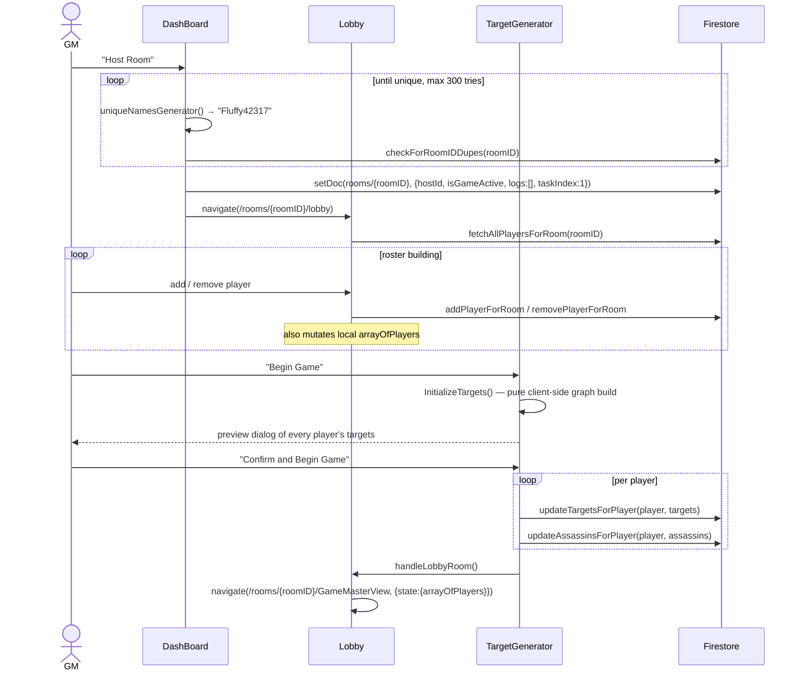
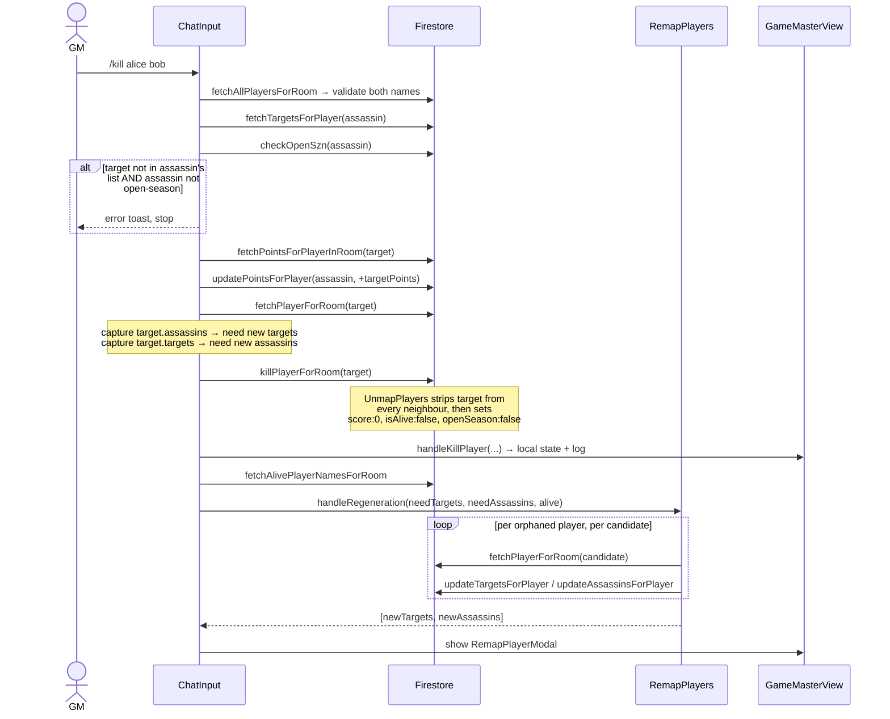
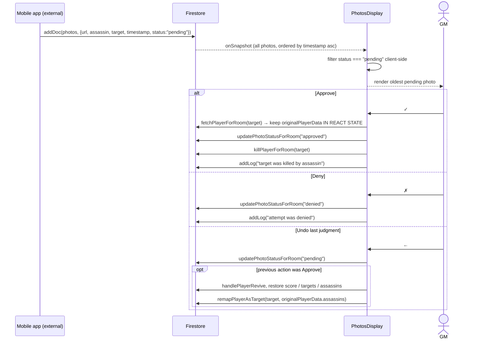
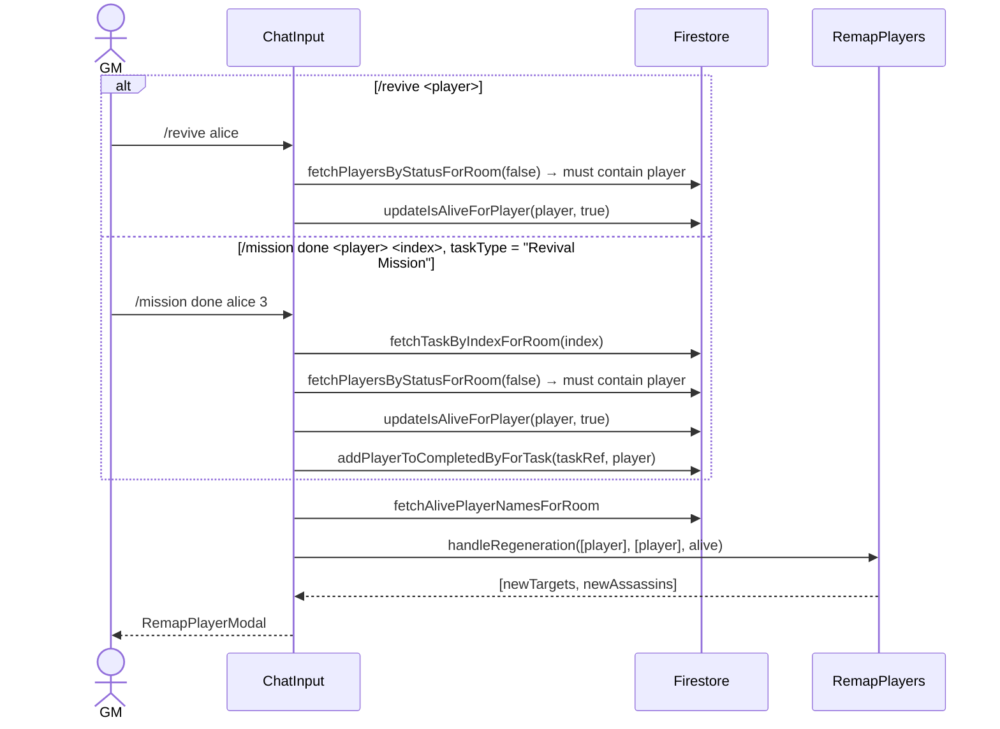

# Game flows

Sequence diagrams for the four flows that matter. Everything shown runs in the
browser — there is no server-side step anywhere in this document.

---

## 1. Hosting a room and starting a game



Two things to note:

- The guard is `arrayOfPlayers.length <= 1`, so a game can start with two
  players even though `MAXTARGETS` logic assumes more.
- The roster is passed forward in **router state**, not refetched. Reloading the
  console loses it.

### The target assignment algorithm

`TargetGenerator.InitializeTargets` (and its verbatim copy in
`ResetTargetsButton`) builds the graph like this:

```
MAXTARGETS = players > 15 ? 3 : players > 5 ? 2 : 1

shuffle the roster
for each player P:
    for k in 1..MAXTARGETS:
        walk forward from P's lastTargetIndex, wrapping, until a candidate T
        satisfies all of:
          · T has fewer than MAXTARGETS assassins
          · T is not P
          · T is not already one of P's assassins
        assign T; record P as one of T's assassins
        if the walk wraps all the way around, give up on this slot
```

It is a randomized ring-walk, not a true cycle construction. Because a slot can
be abandoned when the walk wraps, players can end up with fewer than
`MAXTARGETS` targets, and the resulting graph is not guaranteed to be a single
connected cycle — it can partition into disjoint sub-games.

The `randomizeArray` helper used to shuffle is a subtly incorrect Fisher–Yates:
it iterates **forward** while drawing `j` from `[0, i]`, which does not produce a
uniform permutation. All three copies share the defect, and `TargetGenerator`'s
copy additionally stops at `length - 1`, never touching the final element.

---

## 2. Killing a player (`/kill target assassin`)

The most involved flow in the app. Roughly 15 sequential Firestore round trips,
none of them batched or transactional.



**Scoring.** The assassin receives the victim's *entire* score (floored at 0),
and the victim's score is zeroed. Since everyone starts at 10, points concentrate
as the game progresses.

**Open season.** `checkOpenSzn` is called with the **assassin's** name, so the
flag being tested is "is the assassin in open season", which lets them kill
anyone. But the resulting boolean is then passed to `handleKillPlayer`, which
logs *"open season has ended for {victim}"* — attributing the assassin's flag to
the victim. Meanwhile `killPlayerForRoom` clears `openSeason` on the victim
regardless. The log and the data can therefore disagree.

**Atomicity.** Every step above is an independent write. A network failure
partway through leaves the target graph half-repaired, with no rollback.

### Remapping

`RemapPlayers.handleRegeneration` runs two near-symmetric passes — one giving
new targets to the victim's former assassins, one giving new assassins to the
victim's former targets. Each pass shuffles the alive roster, fetches each
candidate's document individually, and accepts the first that passes five
filters (candidate not at max, not already paired, not self, requester not
already full).

If a pass finds too few matches it falls back to
`fetchAlivePlayersByAscendAssassinsLengthForRoom` /
`…AscendTargetsLengthForRoom`, which order by the denormalized `…Length`
counters. Those counters go stale whenever `UnmapPlayers` or
`remapPlayerAsTarget` writes the arrays directly, so the fallback can order on
bad data.

The fallback trigger is `newTargetArray.length < MAXTARGETS - 1 ||
newTargetArray.length === 0`. When `MAXTARGETS` is 1 the first clause is
`length < 0`, never true, so only the `=== 0` clause fires — meaning in small
games (≤5 players) the fallback effectively only runs when a player has no
targets at all.

---

## 3. Photo moderation

The mobile app writes a `pending` photo; the GM judges it from the console.



Three important gaps in this flow compared to `/kill`:

1. **No remapping.** Approving a photo kills and unmaps the victim but never
   reassigns targets to the players left orphaned. `/kill` does. The same game
   event produces two different graph states depending on which path the GM used.
2. **No validation.** `/kill` verifies the target is actually on the assassin's
   list. Photo approval performs no such check, so an approved photo can kill a
   player the assassin was never hunting.
3. **Undo is memory-only.** `judgedPhotos` — including the `originalPlayerData`
   snapshot needed to restore a victim — lives in React state. Reloading the
   console makes every prior judgment permanently unundoable, while the photo
   documents themselves remain judged in Firestore.

`updatePointsForPlayer` *adds* to the current score, so the undo restore
(`updatePointsForPlayer(target, originalPlayerData.score)`) works only because
`killPlayerForRoom` zeroed the score first. It is correct by coincidence of
ordering, not by construction.

---

## 4. Reviving a player

Two routes reach the same outcome, with different side effects.



A revived player keeps the score of `0` set at death — revival restores life but
not points. The third route back to life, undoing a photo approval, *does*
restore the score, so the two paths are inconsistent.

`/revive` silently does nothing when the named player is not in the dead list:
the `if` has no `else`, so a typo produces no feedback at all.

---

## Where each flow updates the screen

Because [state lives in three places](./architecture.md#state-management), each
flow updates the UI differently:

| Surface | Mechanism | Stale after reload? |
|---|---|---|
| Player list with scores and targets | `onSnapshot` | No — always live |
| Photo queue | `onSnapshot` | No — always live |
| Log panel | fetched once, appended locally | Yes — shows only this session's writes plus the initial fetch |
| `Players (n)` header count | router state from `Lobby` | Yes — becomes `0` |
| Alive/dead arrays driving `/revive` validation | fetched once on mount, mutated by handlers | Yes |
| Photo undo history | React state only | Yes — lost entirely |
