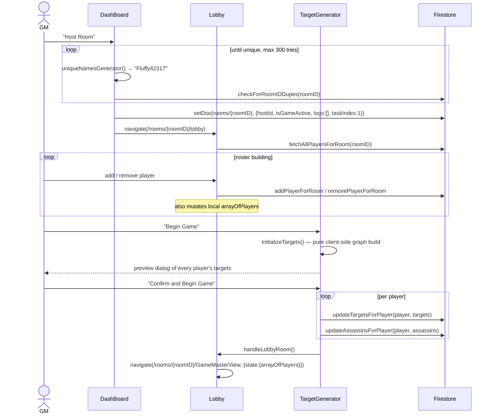
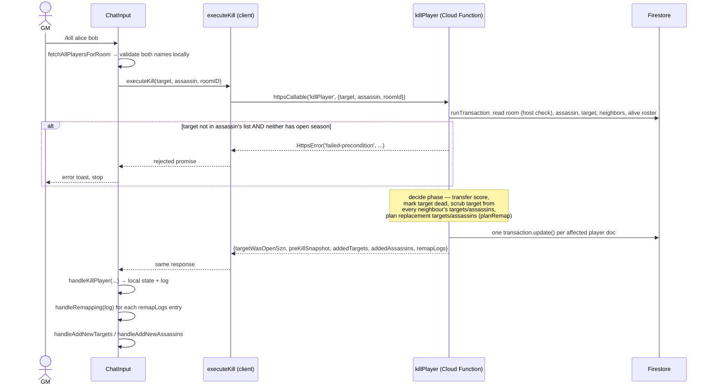
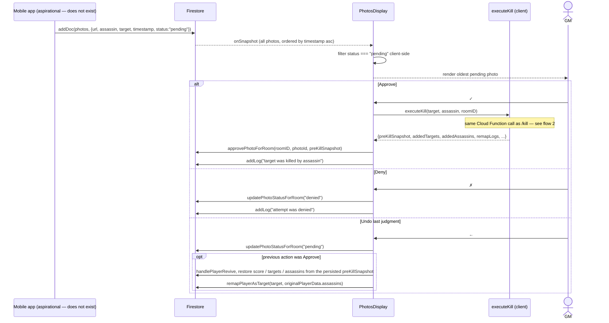
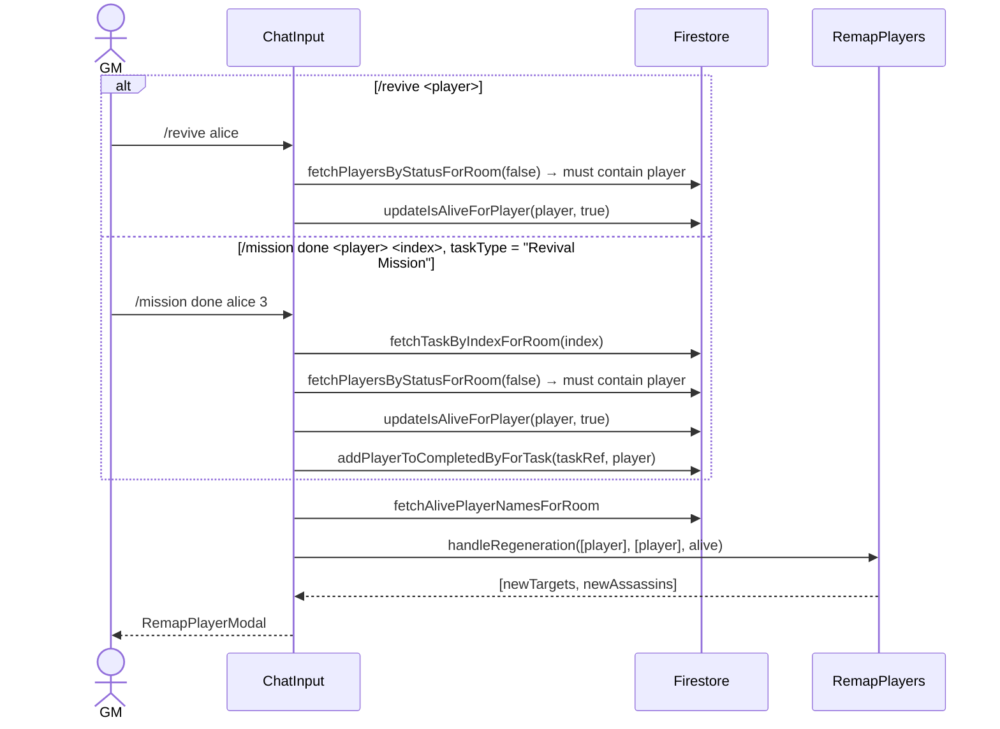

# Game flows

Sequence diagrams for the four flows that matter. Killing a player (flow 2) is
the one step that runs server-side, inside a Cloud Function
(`improvements.md` item 4); everything else shown still runs in the browser.

---

## 1. Hosting a room and starting a game



Two things to note:

- The guard is `arrayOfPlayers.length <= 1`, so a game can start with two
  players even though `MAXTARGETS` logic assumes more.
- The roster is passed forward in **router state**, not refetched. Reloading the
  console loses it.

### The target assignment algorithm

`TargetGenerator.InitializeTargets` (and its verbatim copy in
`ResetTargetsButton`) builds the graph like this:

```
MAXTARGETS = players > 15 ? 3 : players > 5 ? 2 : 1

shuffle the roster
for each player P:
    for k in 1..MAXTARGETS:
        walk forward from P's lastTargetIndex, wrapping, until a candidate T
        satisfies all of:
          · T has fewer than MAXTARGETS assassins
          · T is not P
          · T is not already one of P's assassins
        assign T; record P as one of T's assassins
        if the walk wraps all the way around, give up on this slot
```

It is a randomized ring-walk, not a true cycle construction. Because a slot can
be abandoned when the walk wraps, players can end up with fewer than
`MAXTARGETS` targets, and the resulting graph is not guaranteed to be a single
connected cycle — it can partition into disjoint sub-games.

The `randomizeArray` helper used to shuffle is a subtly incorrect Fisher–Yates:
it iterates **forward** while drawing `j` from `[0, i]`, which does not produce a
uniform permutation. All three copies share the defect, and `TargetGenerator`'s
copy additionally stops at `length - 1`, never touching the final element.

---

## 2. Killing a player (`/kill target assassin`)

Resolved by `improvements.md` item 4. What used to be ~15 sequential,
unbatched Firestore round trips from the browser is now a single
`httpsCallable` request to a Cloud Function, `killPlayer`, which does
everything inside one Firestore transaction.



**Scoring.** The assassin receives the victim's _entire_ score (floored at 0),
and the victim's score is zeroed. Since everyone starts at 10, points concentrate
as the game progresses. Unchanged by item 4 — only where it runs changed.

**Open season.** The three-way rule is: the target is on the assassin's list,
OR the target has open season on themself, OR the assassin has open season
(blanket rights). `killPlayer` reads both `assassinData.openSeason` and
`targetData.openSeason` directly inside the transaction — the confusing
assassin/victim mixup the old client code had (checking the assassin's flag
but logging as if it were the victim's) is gone along with the code that had
it, since `targetWasOpenSzn` returned to the client is always read from the
target's own document.

**Atomicity.** No longer independent writes — either the whole transaction
lands (score transfer, victim marked dead, every neighbour unmapped, every
orphaned player remapped) or none of it does. A network failure partway
through can no longer leave the target graph half-repaired.

### Remapping

Folded into the same transaction as the kill itself, not a separate
client-driven step. `killPlayer` calls the same pure `planRemap`
(`src/game/remapPlan.js`) the old `RemapPlayers.handleRegeneration` used,
but against an in-memory roster read once in the transaction's read phase
(with the about-to-die target filtered out and scrubbed from every
neighbour's arrays, since a transaction's writes haven't landed yet when the
roster is read) rather than one Firestore document fetched per candidate.

`RemapPlayers.js` itself still exists and is still used for `/revive` — see
flow 4 — where the same one-write-at-a-time caveat described in
`improvements.md` item 17 still applies.

---

## 3. Photo moderation

The mobile app writes a `pending` photo; the GM judges it from the console.
**Aspirational** — no such app exists yet (`improvements.md` item 33), so
this flow has no way to start today except manual/emulator seeding of a
`photos` document.



`PhotosDisplay` calls the exact same `executeKill` (and therefore the same
`killPlayer` Cloud Function) `/kill` does — resolved by `improvements.md`
item 5, then item 4 moved what `executeKill` does server-side. This closed
what used to be two real gaps between the photo-approval path and `/kill`:
approving a photo now validates the target the same way `/kill` does, and now
remaps orphaned players the same way `/kill` does, since both call the same
function. `preKillSnapshot` — the `{score, targets, assassins}` returned by
`killPlayer` from before the kill — is persisted onto the photo document
itself (`approvePhotoForRoom`) rather than kept only in React state, which is
what makes Undo survive a reload (`improvements.md` item 6).

---

## 4. Reviving a player

Two routes reach the same outcome, with different side effects.



A revived player keeps the score of `0` set at death — revival restores life but
not points. The third route back to life, undoing a photo approval, _does_
restore the score, so the two paths are inconsistent.

`/revive` silently does nothing when the named player is not in the dead list:
the `if` has no `else`, so a typo produces no feedback at all.

---

## Where each flow updates the screen

Because [state lives in three places](./architecture.md#state-management), each
flow updates the UI differently:

| Surface                                        | Mechanism                                  | Stale after reload?                                           |
| ---------------------------------------------- | ------------------------------------------ | ------------------------------------------------------------- |
| Player list with scores and targets            | `onSnapshot`                               | No — always live                                              |
| Photo queue                                    | `onSnapshot`                               | No — always live                                              |
| Log panel                                      | fetched once, appended locally             | Yes — shows only this session's writes plus the initial fetch |
| `Players (n)` header count                     | router state from `Lobby`                  | Yes — becomes `0`                                             |
| Alive/dead arrays driving `/revive` validation | fetched once on mount, mutated by handlers | Yes                                                           |
| Photo undo history                             | React state only                           | Yes — lost entirely                                           |
