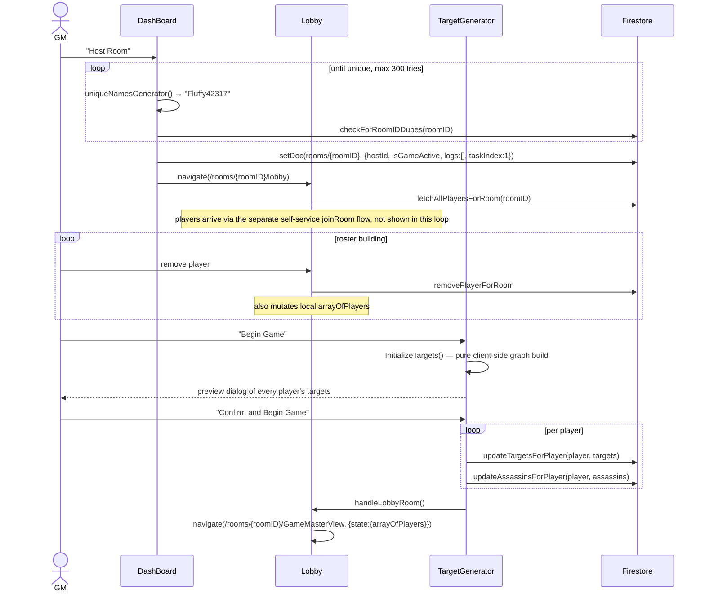

# Audit Batch A: Small Fixes Implementation Plan

> **For agentic workers:** REQUIRED SUB-SKILL: Use superpowers:subagent-driven-development (recommended) or superpowers:executing-plans to implement this plan task-by-task. Steps use checkbox (`- [ ]`) syntax for tracking.

**Goal:** Fix seven small, independent, low-risk items surfaced by this
session's live-game-flow audit: player-removal confirmation, a GM
pending-photo count, a real PWA manifest, `/openseason` no-op feedback, the
Dashboard double-room race, input length caps, and a `docs/game-flows.md`
sync — then record all seven as resolved in `docs/improvements.md`.

**Architecture:** Each of the seven fixes touches its own file(s) with no
interdependency; they can land in any order. The eighth and final task
depends on all seven landing first, since it marks them resolved in the
project's living backlog.

**Tech Stack:** React, Chakra UI, Firebase (Firestore client SDK), Jest +
Testing Library (`dom` project for components, `integration` project
against the real Firestore emulator for `dbCalls.js`).

## Global Constraints

- CLAUDE.md's four-command gate (`npm run format`, `npm run lint`,
  `npm test`, `npm run build`) must pass before any task is considered
  done.
- TDD: write the failing test first, per CLAUDE.md — applies to every task
  that has an automated test (Tasks 1, 2, 4, 5, 6). Task 3 has no
  automated test (see its own section for why).
- No changes to `firestore.rules` or `firestore.indexes.json` in any task.
- Task 6 (length caps) is deliberately client-side only — no
  `firestore.rules`-level enforcement. This is a scope boundary, not an
  oversight: server-side enforcement belongs with a later batch that
  addresses kill-photo/chat identity spoofing and rate limiting, where
  "can a client lie to the server" concerns are handled together.

---

### Task 1: Confirm before removing a player

**Files:**

- Modify: `src/components/lobby_components/PlayerRemove.js`
- Test: `src/components/lobby_components/PlayerRemove.test.jsx` (new file)

**Interfaces:**

- Consumes: nothing from other tasks.
- Produces: nothing consumed elsewhere.

Current full content of `src/components/lobby_components/PlayerRemove.js`:

```jsx
import React, { useState } from 'react';
import { Flex, Button, Select } from '@chakra-ui/react';
import CreateAlert from '../CreateAlert';
import { removePlayerForRoom } from '../firebase_calls/dbCalls';

//import {playerData} from './PlayerList';
const PlayerRemove = ({ onPlayerRemoved, arrayOfPlayers, roomID }) => {
    const [selectedPlayer, setSelectedPlayer] = useState('');
    const createAlert = CreateAlert();

    //allows for pressing enter
    const handleSubmit = () => {
        handleRemovePlayer();
    };

    //updates selected player
    const handleChange = (event) => {
        setSelectedPlayer(event.target.value);
    };

    //deletes player in database
    const handleRemovePlayer = async () => {
        //checks if any player is selected
        if (selectedPlayer === '') {
            return createAlert('error', 'Error', 'must select player', 1500);
        }
        try {
            await removePlayerForRoom(selectedPlayer, roomID);
        } catch (error) {
            console.error('Error removing player: ', error);
            return createAlert('error', 'Error', 'player not found', 1500);
        }

        if (onPlayerRemoved) {
            onPlayerRemoved(selectedPlayer);
        }
        setSelectedPlayer('');
        console.log(`selected player removed successfully`);
    };

    return (
        <form onSubmit={handleSubmit}>
            <Flex>
                <Select
                    placeholder="Select player to remove"
                    value={selectedPlayer}
                    onChange={handleChange}
                    size="lg"
                    mr="6px"
                    borderRadius="3xl"
                >
                    {arrayOfPlayers.map((player, index) => (
                        <option key={index} value={player}>
                            {player}
                        </option>
                    ))}
                </Select>
                <Button
                    onClick={handleRemovePlayer}
                    colorScheme="blue"
                    size="lg"
                    borderRadius="3xl"
                >
                    Remove
                </Button>
            </Flex>
        </form>
    );
};

export default PlayerRemove;
```

For reference, `src/components/header_components/ResetTargetsButton.js`
already has this exact AlertDialog confirmation pattern for a destructive
GM action — read that file directly before writing this task's diff, to
match its `useDisclosure`/`cancelRef`/`AlertDialogContent bg="#202030"`/
"Go Back"/"Confirm" structure precisely, including its dark-theme styling.

- [ ] **Step 1: Write the failing test**

Create `src/components/lobby_components/PlayerRemove.test.jsx`:

```jsx
/**
 * Layer 3 — component test, jsdom + Testing Library.
 *
 * Removing a player is destructive and irreversible (a plain deleteDoc,
 * no snapshot) — this now requires confirmation via an AlertDialog,
 * matching ResetTargetsButton.js's existing pattern for the same reason
 * (docs/superpowers/specs/2026-08-17-audit-batch-a-fixes-design.md).
 */
import React from 'react';
import { ChakraProvider } from '@chakra-ui/react';
import { render, screen } from '@testing-library/react';
import userEvent from '@testing-library/user-event';
import PlayerRemove from './PlayerRemove';
import { removePlayerForRoom } from '../firebase_calls/dbCalls';

jest.mock('../firebase_calls/dbCalls', () => ({
    removePlayerForRoom: jest.fn(),
}));

const onPlayerRemoved = jest.fn();

const mountPlayerRemove = (arrayOfPlayers = ['alice', 'bob']) =>
    render(
        <ChakraProvider>
            <PlayerRemove
                onPlayerRemoved={onPlayerRemoved}
                arrayOfPlayers={arrayOfPlayers}
                roomID="room-a"
            />
        </ChakraProvider>
    );

beforeEach(() => {
    jest.clearAllMocks();
    removePlayerForRoom.mockResolvedValue(undefined);
});

describe('PlayerRemove', () => {
    it('shows an error and does not open the dialog when no player is selected', async () => {
        mountPlayerRemove();

        await userEvent.click(screen.getByRole('button', { name: 'Remove' }));

        expect(await screen.findByText('must select player')).toBeInTheDocument();
        expect(removePlayerForRoom).not.toHaveBeenCalled();
    });

    it('opens a confirmation dialog instead of removing immediately', async () => {
        mountPlayerRemove();

        await userEvent.selectOptions(screen.getByRole('combobox'), 'alice');
        await userEvent.click(screen.getByRole('button', { name: 'Remove' }));

        expect(screen.getByText(/remove alice/i)).toBeInTheDocument();
        expect(removePlayerForRoom).not.toHaveBeenCalled();
    });

    it('removes the player only after Confirm is clicked', async () => {
        mountPlayerRemove();

        await userEvent.selectOptions(screen.getByRole('combobox'), 'alice');
        await userEvent.click(screen.getByRole('button', { name: 'Remove' }));
        await userEvent.click(screen.getByRole('button', { name: 'Confirm' }));

        expect(removePlayerForRoom).toHaveBeenCalledWith('alice', 'room-a');
        expect(onPlayerRemoved).toHaveBeenCalledWith('alice');
    });

    it('removes nothing when Go Back is clicked', async () => {
        mountPlayerRemove();

        await userEvent.selectOptions(screen.getByRole('combobox'), 'alice');
        await userEvent.click(screen.getByRole('button', { name: 'Remove' }));
        await userEvent.click(screen.getByRole('button', { name: 'Go Back' }));

        expect(removePlayerForRoom).not.toHaveBeenCalled();
        expect(screen.queryByText(/remove alice/i)).not.toBeInTheDocument();
    });
});
```

- [ ] **Step 2: Run the test to verify it fails**

Run: `npx jest src/components/lobby_components/PlayerRemove.test.jsx`
Expected: FAIL — no dialog exists yet, so `screen.getByText(/remove
alice/i)` and the "Confirm"/"Go Back" buttons are not found.

- [ ] **Step 3: Write the implementation**

Replace the full contents of `src/components/lobby_components/PlayerRemove.js`:

```jsx
import React from 'react';
import {
    AlertDialog,
    AlertDialogBody,
    AlertDialogContent,
    AlertDialogFooter,
    AlertDialogHeader,
    AlertDialogOverlay,
    Button,
    Flex,
    Select,
    useDisclosure,
} from '@chakra-ui/react';
import { useState } from 'react';
import CreateAlert from '../CreateAlert';
import { removePlayerForRoom } from '../firebase_calls/dbCalls';

//import {playerData} from './PlayerList';
const PlayerRemove = ({ onPlayerRemoved, arrayOfPlayers, roomID }) => {
    const [selectedPlayer, setSelectedPlayer] = useState('');
    const createAlert = CreateAlert();
    const { isOpen, onOpen, onClose } = useDisclosure();
    const cancelRef = React.useRef();

    //updates selected player
    const handleChange = (event) => {
        setSelectedPlayer(event.target.value);
    };

    // Opens the confirmation dialog instead of removing immediately —
    // removePlayerForRoom is a plain, irreversible deleteDoc
    // (docs/superpowers/specs/2026-08-17-audit-batch-a-fixes-design.md).
    const handleRemoveClick = () => {
        if (selectedPlayer === '') {
            return createAlert('error', 'Error', 'must select player', 1500);
        }
        onOpen();
    };

    //deletes player in database
    const handleConfirmRemove = async () => {
        try {
            await removePlayerForRoom(selectedPlayer, roomID);
        } catch (error) {
            console.error('Error removing player: ', error);
            onClose();
            return createAlert('error', 'Error', 'player not found', 1500);
        }

        if (onPlayerRemoved) {
            onPlayerRemoved(selectedPlayer);
        }
        setSelectedPlayer('');
        onClose();
    };

    return (
        <form
            onSubmit={(event) => {
                event.preventDefault();
                handleRemoveClick();
            }}
        >
            <Flex>
                <Select
                    placeholder="Select player to remove"
                    value={selectedPlayer}
                    onChange={handleChange}
                    size="lg"
                    mr="6px"
                    borderRadius="3xl"
                >
                    {arrayOfPlayers.map((player, index) => (
                        <option key={index} value={player}>
                            {player}
                        </option>
                    ))}
                </Select>
                <Button onClick={handleRemoveClick} colorScheme="blue" size="lg" borderRadius="3xl">
                    Remove
                </Button>
            </Flex>
            <AlertDialog isOpen={isOpen} leastDestructiveRef={cancelRef} onClose={onClose}>
                <AlertDialogOverlay />
                <AlertDialogContent bg="#202030">
                    <AlertDialogHeader color="red">WARNING</AlertDialogHeader>
                    <AlertDialogBody color="#FFFFFF">
                        Remove {selectedPlayer}? This permanently deletes their player document and
                        cannot be undone.
                    </AlertDialogBody>
                    <AlertDialogFooter>
                        <Button ref={cancelRef} onClick={onClose} colorScheme="red">
                            Go Back
                        </Button>
                        <Button colorScheme="green" onClick={handleConfirmRemove}>
                            Confirm
                        </Button>
                    </AlertDialogFooter>
                </AlertDialogContent>
            </AlertDialog>
        </form>
    );
};

export default PlayerRemove;
```

(Pressing Enter inside the `Select` still opens the confirmation dialog,
same as clicking Remove — it no longer removes anyone immediately, which
is the point of this fix. The stray `console.log` from the old code is
also dropped, matching this file's otherwise-clean error handling.)

- [ ] **Step 4: Run the test to verify it passes**

Run: `npx jest src/components/lobby_components/PlayerRemove.test.jsx`
Expected: PASS, 4 tests.

- [ ] **Step 5: Run the full gate**

```bash
npm run format
npm run lint
npm test
npm run build
```

All four must pass. `npm test` must show no regression in any file that
renders `PlayerRemove` (e.g. `Lobby.test.jsx` — check its output).

- [ ] **Step 6: Commit**

```bash
git add src/components/lobby_components/PlayerRemove.js src/components/lobby_components/PlayerRemove.test.jsx
git commit -m "Require confirmation before removing a player from the roster"
```

---

### Task 2: GM pending-photo count

**Files:**

- Modify: `src/components/photos_display_component/PhotosDisplay.js`
- Test: `src/components/photos_display_component/PhotosDisplay.test.jsx`

**Interfaces:**

- Consumes: nothing from other tasks.
- Produces: nothing consumed elsewhere.

Current relevant section of `src/components/photos_display_component/PhotosDisplay.js`
(the render method; the rest of the file — `handlePass`/`handleDeny`/
`handleUndo`/the `useEffect` subscription — is unchanged by this task,
read the full file before editing to keep everything else byte-identical):

```jsx
    return (
        <>
            <Box sx={styles.photosContainer}>
                <Heading size="lg" m="4px">
                    Photos
                </Heading>
                <Box sx={styles.photosBox}>
                    <GamePhotos photo={unjudgedPhotos[0]} />
                </Box>
```

- [ ] **Step 1: Write the failing test**

Read `src/components/photos_display_component/PhotosDisplay.test.jsx` in
full first — it already has a `mountWithSnapshot(photoDocs)` helper that
simulates `onSnapshot` reporting a given list of photo docs on mount (see
its `describe`/`beforeEach` for the existing mock setup for
`gameContext`/`executionContext`/`dbCalls`/`executeKill`/`undoKill`). Add
these two tests, matching that file's existing style exactly:

```jsx
it('shows the pending count in the heading when photos are awaiting review', () => {
    mountWithSnapshot([
        { assassin: 'alice', target: 'bob', status: 'pending' },
        { assassin: 'carol', target: 'dave', status: 'pending' },
    ]);

    expect(screen.getByText('Photos (2 pending)')).toBeInTheDocument();
});

it('shows a plain heading when no photos are awaiting review', () => {
    mountWithSnapshot([]);

    expect(screen.getByText('Photos')).toBeInTheDocument();
    expect(screen.queryByText(/pending/)).not.toBeInTheDocument();
});
```

- [ ] **Step 2: Run the test to verify it fails**

Run: `npx jest src/components/photos_display_component/PhotosDisplay.test.jsx`
Expected: FAIL — the heading currently always renders the literal text
`Photos`, so `screen.getByText('Photos (2 pending)')` is not found.

- [ ] **Step 3: Write the implementation**

In `src/components/photos_display_component/PhotosDisplay.js`, change:

```jsx
<Heading size="lg" m="4px">
    Photos
</Heading>
```

to:

```jsx
<Heading size="lg" m="4px">
    Photos{unjudgedPhotos.length > 0 ? ` (${unjudgedPhotos.length} pending)` : ''}
</Heading>
```

- [ ] **Step 4: Run the test to verify it passes**

Run: `npx jest src/components/photos_display_component/PhotosDisplay.test.jsx`
Expected: PASS — all existing tests plus the 2 new ones.

- [ ] **Step 5: Run the full gate**

```bash
npm run format
npm run lint
npm test
npm run build
```

All four must pass.

- [ ] **Step 6: Commit**

```bash
git add src/components/photos_display_component/PhotosDisplay.js src/components/photos_display_component/PhotosDisplay.test.jsx
git commit -m "Show a pending-photo count in the GM photo queue heading"
```

---

### Task 3: Real PWA manifest

**Files:**

- Modify: `public/manifest.json`
- Modify: `public/index.html`
- Modify (regenerated, not hand-edited): `public/logo192.png`
- Modify (regenerated, not hand-edited): `public/logo512.png`

**Interfaces:**

- Consumes: `src/assets/mall-logo-white-2.png` (already exists, 1536×1536
  RGBA PNG, already square — do not modify this source file).
- Produces: nothing consumed elsewhere.

No automated test for this task — a manifest/icon swap isn't meaningfully
unit-testable in this codebase's test setup. Verification is manual, via
`npm run build` and inspecting the build output, per Step 3 below. The
CLAUDE.md four-command gate still fully applies otherwise.

- [ ] **Step 1: Regenerate the icons**

Run (macOS's built-in `sips` command — no new dependency):

```bash
sips -z 192 192 src/assets/mall-logo-white-2.png --out public/logo192.png
sips -z 512 512 src/assets/mall-logo-white-2.png --out public/logo512.png
```

Confirm both commands exit 0 and the output files are valid PNGs at the
right dimensions:

```bash
file public/logo192.png public/logo512.png
```

Expected: `public/logo192.png: PNG image data, 192 x 192, ...` and
`public/logo512.png: PNG image data, 512 x 512, ...`.

- [ ] **Step 2: Update the manifest and index.html**

Current full content of `public/manifest.json`:

```json
{
    "short_name": "React App",
    "name": "Create React App Sample",
    "icons": [
        {
            "src": "favicon.ico",
            "sizes": "64x64 32x32 24x24 16x16",
            "type": "image/x-icon"
        },
        {
            "src": "logo192.png",
            "type": "image/png",
            "sizes": "192x192"
        },
        {
            "src": "logo512.png",
            "type": "image/png",
            "sizes": "512x512"
        }
    ],
    "start_url": ".",
    "display": "standalone",
    "theme_color": "#000000",
    "background_color": "#ffffff"
}
```

Replace with:

```json
{
    "short_name": "Mall Mystery Heroes",
    "name": "Mall Mystery Heroes",
    "icons": [
        {
            "src": "favicon.ico",
            "sizes": "64x64 32x32 24x24 16x16",
            "type": "image/x-icon"
        },
        {
            "src": "logo192.png",
            "type": "image/png",
            "sizes": "192x192"
        },
        {
            "src": "logo512.png",
            "type": "image/png",
            "sizes": "512x512"
        }
    ],
    "start_url": ".",
    "display": "standalone",
    "theme_color": "#202030",
    "background_color": "#202030"
}
```

In `public/index.html`, find `<meta name="theme-color" content="#000000" />`
(near the top of the `<head>`) and change it to
`<meta name="theme-color" content="#202030" />`. Do not change anything
else in this file.

- [ ] **Step 3: Verify manually**

```bash
npm run build
cat build/manifest.json
file build/logo192.png build/logo512.png
```

Expected: `build/manifest.json` shows `"short_name": "Mall Mystery
Heroes"` and `"theme_color": "#202030"`; both icon files are present and
match the dimensions confirmed in Step 1 (CRA copies `public/` into
`build/` verbatim, so this proves the real production build ships the new
assets).

- [ ] **Step 4: Run the full gate**

```bash
npm run format
npm run lint
npm test
npm run build
```

All four must pass (this task touches no `.js`/`.jsx` file, so `lint` and
`test` are unaffected; `build` is this task's actual verification, per
Step 3).

- [ ] **Step 5: Commit**

```bash
git add public/manifest.json public/index.html public/logo192.png public/logo512.png
git commit -m "Replace default CRA branding with real app icon and colors"
```

---

### Task 4: `/openseason` feedback on an already-open season

**Files:**

- Modify: `src/components/logs_components/ChatInput.js`
- Test: `src/components/logs_components/ChatInput.test.jsx`

**Interfaces:**

- Consumes: nothing from other tasks.
- Produces: nothing consumed elsewhere.

Current `/openseason` case in `src/components/logs_components/ChatInput.js`
(inside `handleCommandExecution`'s `switch (commandLine)`, read the full
file before editing — it has many other command cases that must stay
byte-identical):

```jsx
            case '/openseason':
                // TO DO: double check szn alrdy on/off
                // sanity check openSeason target
                playerName = args[0] ? normalizePlayerName(args[0]) : '';
                arg = args[1] ? args[1].toLowerCase() : '';
                if (arrayOfPlayerNames.includes(playerName)) {
                    switch (arg) {
                        case 'start':
                            await setOpenSznOfPlayerToValueForRoom(playerName, true, roomID);
                            handleOpenSznstarted(resolvePlayerDisplayName(playerName, players));
                            break;
                        case 'end':
                            await setOpenSznOfPlayerToValueForRoom(playerName, false, roomID);
                            handleOpenSznended(resolvePlayerDisplayName(playerName, players));
                            break;
                        default:
                            createAlert('error', 'Error', `${args[1]} is not a valid input`, 1500);
                            console.error(`${args[1]} is not a valid input`);
                            break;
                    }
                } else {
                    createAlert('error', 'Error', `${args[0]} is not a valid player`, 1500);
                    console.error(`${args[0]} is not a valid player`);
                }
                break;
```

`players` (this function's parameter, sourced from `gameContext`'s live
roster) already carries each player's current `openSeason` boolean —
confirmed via `GameMasterView.js`'s own player subscription shape
`{name, score, targets, openSeason, isAlive}`.

- [ ] **Step 1: Write the failing test**

Read `src/components/logs_components/ChatInput.test.jsx` in full first —
it has a `mountChatInput(players, isGameActive)` helper and a
`typeAndSubmit(input, text)` helper already used by the existing
`'/openseason start passes the actual casing to handleOpenSznstarted'`
and `'/openseason end passes the actual casing to handleOpenSznended'`
tests (in the `describe("chat log messages show a player's actual stored
casing, not the lowercased matching key", ...)` block). Add these two new
tests immediately after those two, in the same `describe` block:

```jsx
it('/openseason start on an already-open season shows an error and does not write', async () => {
    const commandInput = mountChatInput([{ name: 'Alice', isAlive: true, openSeason: true }]);
    typeAndSubmit(commandInput, '/openseason alice start');

    expect(await screen.findByText(/alice.?s open season is already started/i)).toBeInTheDocument();
    expect(dbCalls.setOpenSznOfPlayerToValueForRoom).not.toHaveBeenCalled();
    expect(executionHandlers.handleOpenSznstarted).not.toHaveBeenCalled();
});

it('/openseason end on an already-closed season shows an error and does not write', async () => {
    const commandInput = mountChatInput([{ name: 'Alice', isAlive: true, openSeason: false }]);
    typeAndSubmit(commandInput, '/openseason alice end');

    expect(await screen.findByText(/alice.?s open season is already ended/i)).toBeInTheDocument();
    expect(dbCalls.setOpenSznOfPlayerToValueForRoom).not.toHaveBeenCalled();
    expect(executionHandlers.handleOpenSznended).not.toHaveBeenCalled();
});
```

(The existing two `/openseason` tests in this same block use players with
no `openSeason` field at all — `undefined` — so `undefined !== true` and
`undefined !== false` both hold and neither existing test's write gets
skipped by this fix; they should keep passing unmodified. Confirm this
directly when you run the suite in Step 4, don't just assume it.)

- [ ] **Step 2: Run the test to verify it fails**

Run: `npx jest src/components/logs_components/ChatInput.test.jsx`
Expected: FAIL on the 2 new tests — no no-op guard exists yet, so
`setOpenSznOfPlayerToValueForRoom` gets called and the new error text
never renders.

- [ ] **Step 3: Write the implementation**

In `src/components/logs_components/ChatInput.js`, replace the
`/openseason` case with:

```jsx
            case '/openseason':
                playerName = args[0] ? normalizePlayerName(args[0]) : '';
                arg = args[1] ? args[1].toLowerCase() : '';
                if (arrayOfPlayerNames.includes(playerName)) {
                    const openSznTarget = players.find(
                        (player) => normalizePlayerName(player.name) === playerName
                    );
                    switch (arg) {
                        case 'start':
                            if (openSznTarget?.openSeason === true) {
                                createAlert(
                                    'error',
                                    'Error',
                                    `${resolvePlayerDisplayName(playerName, players)}'s open season is already started`,
                                    1500
                                );
                                break;
                            }
                            await setOpenSznOfPlayerToValueForRoom(playerName, true, roomID);
                            handleOpenSznstarted(resolvePlayerDisplayName(playerName, players));
                            break;
                        case 'end':
                            if (openSznTarget?.openSeason === false) {
                                createAlert(
                                    'error',
                                    'Error',
                                    `${resolvePlayerDisplayName(playerName, players)}'s open season is already ended`,
                                    1500
                                );
                                break;
                            }
                            await setOpenSznOfPlayerToValueForRoom(playerName, false, roomID);
                            handleOpenSznended(resolvePlayerDisplayName(playerName, players));
                            break;
                        default:
                            createAlert('error', 'Error', `${args[1]} is not a valid input`, 1500);
                            console.error(`${args[1]} is not a valid input`);
                            break;
                    }
                } else {
                    createAlert('error', 'Error', `${args[0]} is not a valid player`, 1500);
                    console.error(`${args[0]} is not a valid player`);
                }
                break;
```

(Removed the stale `// TO DO: double check szn alrdy on/off` comment —
this is that check.)

- [ ] **Step 4: Run the test to verify it passes**

Run: `npx jest src/components/logs_components/ChatInput.test.jsx`
Expected: PASS — every existing test in this file plus the 2 new ones.
This file has many tests; confirm the full count in the output, not just
the 2 new ones.

- [ ] **Step 5: Run the full gate**

```bash
npm run format
npm run lint
npm test
npm run build
```

All four must pass.

- [ ] **Step 6: Commit**

```bash
git add src/components/logs_components/ChatInput.js src/components/logs_components/ChatInput.test.jsx
git commit -m "Show an error instead of silently no-opping on a redundant openseason command"
```

---

### Task 5: Dashboard double-room race — deterministic ordering

**Files:**

- Modify: `src/pages/DashBoard.js`
- Modify: `src/components/firebase_calls/dbCalls.js`
- Test: `src/pages/DashBoard.test.jsx`
- Test: `src/components/firebase_calls/dbCalls.integration.test.js`

**Interfaces:**

- Consumes: nothing from other tasks.
- Produces: `fetchActiveRoomForHost` keeps its existing signature
  (`(hostId: string) => Promise<{id: string, gameStarted: boolean} | null>`)
  — its internal tie-breaking logic changes, its return shape does not.

This does NOT prevent two rooms from ever being created by a genuine race
(two logins landing at nearly the same instant) — it only makes every
subsequent lookup consistently land on the newest one, instead of an
arbitrary one, per the approved design. No `firestore.rules` or
`firestore.indexes.json` change — the query shape
(`where('hostId', '==', hostId)`) is unchanged; the new ordering happens
in JS after the existing read, not via a Firestore `orderBy`.

Current full content of `src/pages/DashBoard.js`:

```jsx
import React, { useEffect } from 'react';
import { auth, db } from '../utils/firebase';
import { setDoc, doc } from 'firebase/firestore';
import { Center, Spinner } from '@chakra-ui/react';
import { useNavigate } from 'react-router-dom';
import { adjectives, uniqueNamesGenerator } from 'unique-names-generator';
import { checkForRoomIDDupes, fetchActiveRoomForHost } from '../components/firebase_calls/dbCalls';
import CreateAlert from '../components/CreateAlert';

// No visible UI: resolves where a logged-in GM belongs and redirects there
// immediately, rather than making them click "Host Room" on a static page
// every time (docs/superpowers/specs/2026-08-08-dashboard-removal-design.md).
// Wrapped in RequireAuth (see App.js), so auth.currentUser is already
// resolved by the time this mounts — no onAuthStateChanged subscription
// needed here, unlike Homepage.js, which isn't behind that guard.
const DashBoard = () => {
    const navigate = useNavigate();
    const createAlert = CreateAlert();

    useEffect(() => {
        const resolveDestination = async () => {
            try {
                const user = auth.currentUser;
                if (!user) {
                    console.error('No user is signed in.');
                    return;
                }

                const existingRoom = await fetchActiveRoomForHost(user.uid);
                if (existingRoom) {
                    const destination = existingRoom.gameStarted ? 'GameMasterView' : 'lobby';
                    navigate(`/rooms/${existingRoom.id}/${destination}`, { replace: true });
                    return;
                }

                let randomRoomNumber;
                let roomID;
                let check = false;
                let runningTime = 0;

                while (!check) {
                    runningTime++;
                    if (runningTime > 300) {
                        createAlert('error', 'Timed Out', 'No Available Room Found', 1500);
                        return;
                    }
                    randomRoomNumber = Math.floor(Math.random() * 90000) + 10000;
                    roomID = uniqueNamesGenerator({
                        dictionaries: [adjectives, [randomRoomNumber.toString()]],
                        separator: '',
                        style: 'capital',
                    });
                    check = await checkForRoomIDDupes(roomID);
                }

                const roomRef = doc(db, 'rooms', roomID);
                await setDoc(roomRef, {
                    hostId: user.uid,
                    isGameActive: true,
                    gameStarted: false,
                    joinedUids: [],
                    taskIndex: 1,
                    storageReference: [],
                });
                navigate(`/rooms/${roomRef.id}/lobby`, { replace: true });
            } catch (error) {
                console.error('Error resolving dashboard destination:', error);
            }
        };

        resolveDestination();
        // eslint-disable-next-line react-hooks/exhaustive-deps
    }, []);

    return (
        <Center h="100vh">
            <Spinner size="xl" />
        </Center>
    );
};

export default DashBoard;
```

Current `fetchActiveRoomForHost` in `src/components/firebase_calls/dbCalls.js`
(lines ~405-424, read the surrounding file before editing):

```jsx
// Finds the room this host is currently running (isGameActive: true), so a
// returning GM lands back in their existing room instead of getting a new
// one created on every login (DashBoard.js,
// docs/superpowers/specs/2026-08-08-dashboard-removal-design.md). The
// firestore.rules `allow list` grant is scoped to exactly this query shape
// (`where('hostId', '==', uid)`) — Firestore can only authorize a `list`
// query when the rule is provably true for every possible result, so the
// isGameActive filter happens here in JS rather than as a second `where`
// clause. A host realistically has at most a couple of rooms, so filtering
// client-side after one read is not a real cost.
export const fetchActiveRoomForHost = async (hostId) => {
    const roomsCollectionRef = collection(db, 'rooms');
    const roomsQuery = query(roomsCollectionRef, where('hostId', '==', hostId));
    const roomsSnapshot = await getDocs(roomsQuery);
    const activeRoomDoc = roomsSnapshot.docs.find(
        (roomDoc) => roomDoc.data().isGameActive === true
    );
    if (!activeRoomDoc) return null;
    return { id: activeRoomDoc.id, gameStarted: activeRoomDoc.data().gameStarted };
};
```

- [ ] **Step 1: Write the failing tests**

In `src/pages/DashBoard.test.jsx`, update the `firebase/firestore` mock
factory to add `serverTimestamp`:

```jsx
jest.mock('firebase/firestore', () => ({
    setDoc: jest.fn(),
    doc: jest.fn((db, collectionName, id) => ({ id })),
    serverTimestamp: jest.fn(() => 'server-timestamp-sentinel'),
}));
```

Update the `import { setDoc } from 'firebase/firestore';` line to also
import `serverTimestamp`:

```jsx
import { setDoc, serverTimestamp } from 'firebase/firestore';
```

Then update the existing `'creates a new room and redirects to its lobby
when no active room exists'` test's assertion — add `createdAt` to the
`objectContaining`:

```jsx
expect(setDoc).toHaveBeenCalledWith(
    expect.anything(),
    expect.objectContaining({
        hostId: 'host-uid',
        isGameActive: true,
        gameStarted: false,
        joinedUids: [],
        taskIndex: 1,
        storageReference: [],
        createdAt: 'server-timestamp-sentinel',
    })
);
```

In `src/components/firebase_calls/dbCalls.integration.test.js`, add
`fetchActiveRoomForHost` to the existing top-of-file import list from
`./dbCalls`, and add `Timestamp` to the existing
`import { doc, getDoc, getDocs, terminate } from 'firebase/firestore';`
line (becomes `import { doc, getDoc, getDocs, terminate, Timestamp } from
'firebase/firestore';`). Then add this new `describe` block (placement
anywhere among the file's other top-level `describe` blocks is fine):

```js
describe('fetchActiveRoomForHost', () => {
    it('returns the most recently created active room when a host has more than one (race-condition safety net)', async () => {
        await seedRoom('room-old', [], {
            createdAt: Timestamp.fromDate(new Date('2026-01-01T00:00:00Z')),
        });
        await seedRoom('room-new', [], {
            createdAt: Timestamp.fromDate(new Date('2026-01-02T00:00:00Z')),
        });

        const result = await fetchActiveRoomForHost(auth.currentUser.uid);

        expect(result.id).toBe('room-new');
    });

    it('returns null when the host has no active room', async () => {
        await seedRoom('someone-elses-room', []);

        const result = await fetchActiveRoomForHost('a-uid-that-hosts-nothing');

        expect(result).toBeNull();
    });
});
```

(`seedRoom`'s default `hostId` is the shared signed-in test identity, the
same one `auth.currentUser.uid` reads after any `seedRoom` call — this
mirrors the pattern `joinRoom.integration.test.js` already uses.)

- [ ] **Step 2: Run the tests to verify they fail**

Run: `npx jest src/pages/DashBoard.test.jsx`
Expected: FAIL — `createdAt` is not yet in the `setDoc` call, so the
`objectContaining` assertion fails.

Run: `npm run test:emulator` (this is an `.integration.test.js` file —
`npm test` does not run it; see Global Constraints and Task-level note
below)
Expected: FAIL on the new `fetchActiveRoomForHost` describe block —
`fetchActiveRoomForHost` is not yet exported/importable the way the test
expects, or returns the wrong room, since the JS-side ordering doesn't
exist yet.

- [ ] **Step 3: Write the implementation**

In `src/pages/DashBoard.js`, change the import line:

```jsx
import { setDoc, doc } from 'firebase/firestore';
```

to:

```jsx
import { setDoc, doc, serverTimestamp } from 'firebase/firestore';
```

And add `createdAt` to the room-creation `setDoc` call:

```jsx
await setDoc(roomRef, {
    hostId: user.uid,
    isGameActive: true,
    gameStarted: false,
    joinedUids: [],
    taskIndex: 1,
    storageReference: [],
    createdAt: serverTimestamp(),
});
```

In `src/components/firebase_calls/dbCalls.js`, replace
`fetchActiveRoomForHost` with:

```jsx
// Finds the room this host is currently running (isGameActive: true), so a
// returning GM lands back in their existing room instead of getting a new
// one created on every login (DashBoard.js,
// docs/superpowers/specs/2026-08-08-dashboard-removal-design.md). The
// firestore.rules `allow list` grant is scoped to exactly this query shape
// (`where('hostId', '==', uid)`) — Firestore can only authorize a `list`
// query when the rule is provably true for every possible result, so the
// isGameActive filter happens here in JS rather than as a second `where`
// clause. A host realistically has at most a couple of rooms, so filtering
// client-side after one read is not a real cost.
//
// Two near-simultaneous logins as the same host can each pass the
// "no active room" check before either write lands, creating two active
// rooms for one host (docs/improvements.md item 52). Sorting by
// `createdAt` here doesn't prevent that — it just makes every subsequent
// lookup land on the same (newest) room instead of an arbitrary one, so a
// returning host is never bounced between two rooms across reloads. A
// room created before this field existed has no `createdAt` at all, and
// sorts as older than any timestamped room.
export const fetchActiveRoomForHost = async (hostId) => {
    const roomsCollectionRef = collection(db, 'rooms');
    const roomsQuery = query(roomsCollectionRef, where('hostId', '==', hostId));
    const roomsSnapshot = await getDocs(roomsQuery);
    const activeRoomDocs = roomsSnapshot.docs.filter(
        (roomDoc) => roomDoc.data().isGameActive === true
    );
    const newestFirst = [...activeRoomDocs].sort((a, b) => {
        const aMillis = a.data().createdAt?.toMillis() ?? 0;
        const bMillis = b.data().createdAt?.toMillis() ?? 0;
        return bMillis - aMillis;
    });
    const activeRoomDoc = newestFirst[0];
    if (!activeRoomDoc) return null;
    return { id: activeRoomDoc.id, gameStarted: activeRoomDoc.data().gameStarted };
};
```

- [ ] **Step 4: Run the tests to verify they pass**

Run: `npx jest src/pages/DashBoard.test.jsx`
Expected: PASS, all 3 tests.

Run: `npm run test:emulator`
Expected: PASS — paste the full, real terminal output in your report
(genuine emulator startup logs, per-suite `PASS` lines, real counts), not
a bare summary. This is the task's real correctness gate for the
`dbCalls.integration.test.js` change — `npm test` does not exercise it at
all.

- [ ] **Step 5: Run the full gate**

```bash
npm run format
npm run lint
npm test
npm run build
```

All four must pass, in addition to the `npm run test:emulator` run above.

- [ ] **Step 6: Commit**

```bash
git add src/pages/DashBoard.js src/pages/DashBoard.test.jsx src/components/firebase_calls/dbCalls.js src/components/firebase_calls/dbCalls.integration.test.js
git commit -m "Make fetchActiveRoomForHost deterministic when a host has more than one active room"
```

---

### Task 6: Length caps on player name and chat message

**Files:**

- Modify: `src/pages/JoinGame.js`
- Modify: `src/components/player_messages_components/MessageComposer.js`
- Test: `src/pages/JoinGame.test.jsx`
- Test: `src/components/player_messages_components/MessageComposer.test.jsx`

**Interfaces:**

- Consumes: nothing from other tasks.
- Produces: nothing consumed elsewhere.

No `firestore.rules` change — this is a client-side-only mitigation, per
the Global Constraints above.

Current relevant JSX in `src/pages/JoinGame.js` (read the full file before
editing — the rest of the form is unchanged by this task):

```jsx
<Input
    placeholder="Your name"
    value={playerName}
    onChange={(e) => setPlayerName(e.target.value)}
    borderWidth="3px"
/>
```

Current relevant JSX in
`src/components/player_messages_components/MessageComposer.js` (read the
full file before editing — the rest of the composer, including the hidden
file input and camera button, is unchanged by this task):

```jsx
<Input
    placeholder="Type a message..."
    value={text}
    onChange={(event) => setText(event.target.value)}
    onKeyDown={handleKeyDown}
    isDisabled={disabled}
    mr={2}
/>
```

- [ ] **Step 1: Write the failing tests**

In `src/pages/JoinGame.test.jsx`, add this test to the existing
`describe('JoinGame', ...)` (or top-level, matching the file's existing
structure — read it first):

```jsx
it('limits the name input to 40 characters', () => {
    renderJoinGame();

    expect(screen.getByPlaceholderText('Your name')).toHaveAttribute('maxlength', '40');
});
```

In `src/components/player_messages_components/MessageComposer.test.jsx`,
add this test to the existing `describe('MessageComposer', ...)`:

```jsx
it('limits the chat message input to 500 characters', () => {
    mountComposer();

    expect(screen.getByPlaceholderText('Type a message...')).toHaveAttribute('maxlength', '500');
});
```

(HTML attributes are lowercase in the DOM regardless of the JSX prop's
`maxLength` casing — confirm `'maxlength'` is the correct string jest-dom
expects by running the test; if it fails only on casing, adjust to
whatever the actual DOM attribute name is and note that in your report.)

- [ ] **Step 2: Run the tests to verify they fail**

Run: `npx jest src/pages/JoinGame.test.jsx src/components/player_messages_components/MessageComposer.test.jsx`
Expected: FAIL on the 2 new tests — neither input has a `maxLength` prop
yet.

- [ ] **Step 3: Write the implementation**

In `src/pages/JoinGame.js`, change:

```jsx
<Input
    placeholder="Your name"
    value={playerName}
    onChange={(e) => setPlayerName(e.target.value)}
    borderWidth="3px"
/>
```

to:

```jsx
<Input
    placeholder="Your name"
    value={playerName}
    onChange={(e) => setPlayerName(e.target.value)}
    borderWidth="3px"
    maxLength={40}
/>
```

In `src/components/player_messages_components/MessageComposer.js`,
change:

```jsx
<Input
    placeholder="Type a message..."
    value={text}
    onChange={(event) => setText(event.target.value)}
    onKeyDown={handleKeyDown}
    isDisabled={disabled}
    mr={2}
/>
```

to:

```jsx
<Input
    placeholder="Type a message..."
    value={text}
    onChange={(event) => setText(event.target.value)}
    onKeyDown={handleKeyDown}
    isDisabled={disabled}
    mr={2}
    maxLength={500}
/>
```

- [ ] **Step 4: Run the tests to verify they pass**

Run: `npx jest src/pages/JoinGame.test.jsx src/components/player_messages_components/MessageComposer.test.jsx`
Expected: PASS — every existing test in both files plus the 2 new ones.

- [ ] **Step 5: Run the full gate**

```bash
npm run format
npm run lint
npm test
npm run build
```

All four must pass.

- [ ] **Step 6: Commit**

```bash
git add src/pages/JoinGame.js src/pages/JoinGame.test.jsx src/components/player_messages_components/MessageComposer.js src/components/player_messages_components/MessageComposer.test.jsx
git commit -m "Add client-side length caps to the join-name and chat-message inputs"
```

---

### Task 7: Sync `docs/game-flows.md` to current reality

**Files:**

- Modify: `docs/game-flows.md`

**Interfaces:**

- Consumes: nothing from other tasks.
- Produces: nothing consumed elsewhere.

Docs-only, no test. Read the full current file
(`docs/game-flows.md`, 280 lines) before editing, to locate each block by
its surrounding text rather than trusting line numbers below, which may
have shifted.

- [ ] **Step 1: Fix flow 1's diagram and its "Two things to note" list**

Replace:



Two things to note:

- The guard is `arrayOfPlayers.length <= 1`, so a game can start with two
  players even though `MAXTARGETS` logic assumes more.
- The roster is passed forward in **router state**, not refetched. Reloading the
  console loses it.

`````

with:

````markdown
```mermaid
sequenceDiagram
    actor GM
    participant DB as DashBoard
    participant Lobby
    participant TG as TargetGenerator
    participant FS as Firestore

    GM->>DB: sign in
    DB->>FS: fetchActiveRoomForHost(uid)
    alt no active room for this host
        loop until unique, max 300 tries
            DB->>DB: uniqueNamesGenerator() → "Fluffy42317"
            DB->>FS: checkForRoomIDDupes(roomID)
        end
        DB->>FS: setDoc(rooms/{roomID}, {hostId, isGameActive, gameStarted, joinedUids:[], taskIndex:1, storageReference:[], createdAt})
    end
    DB->>Lobby: navigate(/rooms/{roomID}/lobby)

    Note over Lobby: players arrive via the separate self-service joinRoom flow, live via onSnapshot — not shown in this loop
    loop roster management
        GM->>Lobby: remove player
        Lobby->>FS: removePlayerForRoom
    end

    GM->>TG: "Begin Game"
    TG->>TG: buildTargetGraph(players) — pure client-side graph build
    TG-->>GM: preview dialog of every player's targets
    GM->>TG: "Confirm and Begin Game"
    TG->>FS: markGameAsStarted(roomID) — gameStarted: true
    loop per player
        TG->>FS: updateTargetsForPlayer(player, targets)
        TG->>FS: updateAssassinsForPlayer(player, assassins)
    end
    TG->>Lobby: handleLobbyRoom()
    Lobby->>Lobby: navigate(/rooms/{roomID}/GameMasterView)
`````

Two things to note:

- The guard is `arrayOfPlayers.length <= 1`, so a game can start with two
  players — `maxTargetsFor` (below) clamps each player's target count down
  for a small roster rather than refusing to start.
- `GameMasterView` no longer receives the roster via router state — it
  subscribes live via `onSnapshot` (`docs/improvements.md` item 13), so a
  reload no longer loses it.

`````

- [ ] **Step 2: Rewrite "The target assignment algorithm"**

Replace the entire section (from `### The target assignment algorithm`
through the paragraph ending "...never touching the final element.",
right before the `---` that precedes `## 2. Killing a player`):

````markdown
### The target assignment algorithm

`TargetGenerator.InitializeTargets` (and its verbatim copy in
`ResetTargetsButton`) builds the graph like this:

```
MAXTARGETS = players > 15 ? 3 : players > 5 ? 2 : 1

shuffle the roster
for each player P:
    for k in 1..MAXTARGETS:
        walk forward from P's lastTargetIndex, wrapping, until a candidate T
        satisfies all of:
          · T has fewer than MAXTARGETS assassins
          · T is not P
          · T is not already one of P's assassins
        assign T; record P as one of T's assassins
        if the walk wraps all the way around, give up on this slot
```

It is a randomized ring-walk, not a true cycle construction. Because a slot can
be abandoned when the walk wraps, players can end up with fewer than
`MAXTARGETS` targets, and the resulting graph is not guaranteed to be a single
connected cycle — it can partition into disjoint sub-games.

The `randomizeArray` helper used to shuffle is a subtly incorrect Fisher–Yates:
it iterates **forward** while drawing `j` from `[0, i]`, which does not produce a
uniform permutation. All three copies share the defect, and `TargetGenerator`'s
copy additionally stops at `length - 1`, never touching the final element.
`````

with:

````markdown
### The target assignment algorithm

`buildTargetGraph` (`src/game/targetGraph.js`) builds the graph like this:

```
maxTargetsFor(playerCount) = clamp(playerCount > 15 ? 3 : playerCount > 5 ? 2 : 1, 0, playerCount - 1)

shuffle the roster (Fisher–Yates/Durstenfeld, on a copy)
lay the shuffled roster out in a ring
for each player P at ring position i:
    for step in 1..maxTargets:
        P hunts the player at ring position (i + step) % count
```

This is a true ring construction, not a search: every player gets exactly
`maxTargets` targets and `maxTargets` assassins, by construction, with no
self-targeting and (whenever `2 * maxTargets < playerCount`) no mutual
pairs. `TargetGenerator.js` and `ResetTargetsButton.js` both call this
same shared function — it replaced two ~120-line duplicate
implementations, plus a differently-shaped third copy in `RemapPlayers.js`
(`docs/improvements.md` item 11).

It replaced `TargetGenerator.InitializeTargets`, a randomized ring-walk
that could abandon a slot when its search wrapped all the way around,
leaving players with fewer than `MAXTARGETS` targets and a graph that
could fracture into disjoint sub-games — and `randomizeArray`, a subtly
incorrect Fisher–Yates that iterated forward while drawing `j` from
`[0, i]`, which does not produce a uniform permutation
(`docs/improvements.md` item 12).

`functions/callableFunctions/killPlayer.js` and `joinRoom.js` also depend
on this file, via a vendored copy — see "Keeping the Cloud Functions
self-contained" below.
````

- [ ] **Step 3: Add the Cloud Functions vendoring note**

Immediately after the "### Remapping" subsection's last paragraph (which
ends "...same one-write-at-a-time caveat described in `improvements.md`
item 17 still applies.") and before the `---` that precedes `## 3. Photo
moderation`, insert a new subsection:

```markdown
### Keeping the Cloud Functions self-contained

`killPlayer.js` and `joinRoom.js` both `require()` `../vendor/game/remapPlan`,
`../vendor/game/playerNames`, and `../vendor/game/targetGraph` rather than
reaching into `src/game/` directly. Firebase's functions deploy uploads
only the `functions/` directory in isolation, so a `require()` reaching
outside it resolves fine locally and under the emulator (both run from
the full repo checkout) but cannot resolve in the actual deployed bundle.
`functions/scripts/sync-shared-game-logic.js` copies the specific
`src/game/` modules these two functions depend on into the gitignored
`functions/vendor/game/` — run automatically before every deploy
(`firebase.json`'s `functions[0].predeploy`) and before
`npm run test:emulator`/`npm run test:rules`, which exercise the same
require paths the real deploy uses. `src/game/` stays the single source
of truth; `functions/vendor/` is a regenerated build artifact, never
hand-edited or committed.
```

- [ ] **Step 4: Fix the stale `/revive` no-feedback note**

In "## 4. Reviving a player", replace:

```markdown
`/revive` silently does nothing when the named player is not in the dead list:
the `if` has no `else`, so a typo produces no feedback at all.
```

with:

```markdown
`/revive` alerts the GM (`"<name>" is not dead`) when the named player is
not in the dead list — previously the `if` had no `else`, so a typo
produced no feedback at all; fixed by `docs/improvements.md` item 21.
```

- [ ] **Step 5: Rewrite "Where each flow updates the screen"**

Replace the entire table (everything from `| Surface` through the row
ending `Yes — lost entirely |`) with:

```markdown
| Surface                                        | Mechanism                                                                       | Stale after reload?    |
| ---------------------------------------------- | ------------------------------------------------------------------------------- | ---------------------- |
| Player list with scores and targets            | `onSnapshot`                                                                    | No — always live       |
| Photo queue                                    | `onSnapshot`                                                                    | No — always live       |
| Log panel                                      | `onSnapshot` (`docs/improvements.md` item 22)                                   | No — always live       |
| `Players (n)` header count                     | derived from the same live `onSnapshot` roster (item 13)                        | No — always live       |
| Alive/dead arrays driving `/revive` validation | refetched via `fetchPlayersByStatusForRoom` on every command                    | No — always current    |
| Photo undo history                             | persisted on the photo doc itself (`preKillSnapshot`), not React state (item 6) | No — survives a reload |
```

- [ ] **Step 6: Run the full gate**

```bash
npm run format
npm run lint
npm test
npm run build
```

All four must pass (this task touches only a `.md` file, so `lint`/`test`
are unaffected by content but `format` reformats markdown in this repo —
confirm it doesn't reflow anything unexpectedly).

- [ ] **Step 7: Commit**

```bash
git add docs/game-flows.md
git commit -m "Sync docs/game-flows.md to the current target-graph algorithm and live-state architecture"
```

---

### Task 8: Close out all seven items in `docs/improvements.md`

**Files:**

- Modify: `docs/improvements.md`

**Interfaces:**

- Consumes: all of Tasks 1-7 (this task only makes sense once they've all
  landed — it documents what they did).
- Produces: nothing consumed elsewhere.

**Depends on Tasks 1-7.** Do not start this task until all seven are
complete and reviewed — its content describes what they actually did.

- [ ] **Step 1: Confirm the next item number**

Run: `grep -n "^### [0-9]" docs/improvements.md | tail -3`
Expected: item 51 is the current highest (added earlier this session for
"GM can broadcast into a void after ending a game"). Use 52-58 for the
seven new items below, in order. If the actual highest number differs,
use the correct next numbers throughout this task instead.

- [ ] **Step 2: Add the seven new items**

Read item 47's exact heading/body format first (`### 47. \`addPlayerForRoom\`
is now unreferenced by any production code path ✅ Resolved`, then
`**Impact: X · Effort: Y**`, then resolution prose) to match its tone
precisely. Add these seven items, in order, after the current last item
(51) and before the `---`/`## Suggested sequencing` divider near the end
of the file:

```markdown
### 52. Removing a player from the roster had no confirmation ✅ Resolved

**Impact: low · Effort: S**

Found during the 2026-08-17 live-game-flow audit. `PlayerRemove.js`
called `removePlayerForRoom` — a plain, irreversible `deleteDoc` — directly
from a Select+Button pair with no confirmation, unlike every other
destructive GM action (`Endgamebutton.js`, `ResetTargetsButton.js`), both
of which already use a Chakra `AlertDialog`.

**Resolution:** `PlayerRemove.js` now opens an `AlertDialog` (matching
`ResetTargetsButton.js`'s existing pattern exactly) naming the selected
player; only its Confirm button actually removes them. 4 new tests.

### 53. GM had no signal that kill photos were awaiting review ✅ Resolved

**Impact: low · Effort: S**

Found during the 2026-08-17 live-game-flow audit. `PhotosDisplay.js`'s
"Photos" heading looked identical whether 0 or 50 photos were pending
review.

**Resolution:** The heading now reads "Photos (N pending)" whenever
`unjudgedPhotos.length > 0`, plain "Photos" otherwise — no new
subscription, `unjudgedPhotos` was already computed state. 2 new tests.

### 54. The PWA manifest was still Create React App's default boilerplate ✅ Resolved

**Impact: low · Effort: S**

Found during the 2026-08-17 live-game-flow audit. `public/manifest.json`
still had `short_name: "React App"`, the stock CRA atom icon, and a
black/white theme — despite a real logo (`src/assets/mall-logo-white-2.png`)
already existing in the repo. This undermined "Add to Home Screen," the
one available mitigation for this app having no push notifications on
phones.

**Resolution:** `manifest.json` now reads "Mall Mystery Heroes" with
`theme_color`/`background_color` matching the app's actual dark
background (`#202030`, `theme.js`'s `brand.300`); `public/index.html`'s
matching `<meta name="theme-color">` was also wrong and is fixed too;
`logo192.png`/`logo512.png` regenerated from the real logo via `sips`. No
automated test — verified via `npm run build` and inspecting the build
output directly.

### 55. \`/openseason\` gave no feedback on a redundant command ✅ Resolved

**Impact: low · Effort: S**

Found during the 2026-08-17 live-game-flow audit — a stale `// TO DO:
double check szn alrdy on/off` comment in `ChatInput.js` marked this as
already known. Re-running `/openseason <name> start` when that player's
season was already open (or `end` when already closed) silently
succeeded with no indication anything was a no-op.

**Resolution:** `ChatInput.js` now checks the target's current
`openSeason` value (already available in the live roster) before writing,
and shows an error alert instead of a silent no-op write when the
requested state already matches. 2 new tests.

### 56. Two near-simultaneous logins as the same host could create two active rooms ✅ Resolved

**Impact: low · Effort: S**

Found during the 2026-08-17 live-game-flow audit. `DashBoard.js`'s
`resolveDestination` is a check-then-act: it queries for an existing
active room, and if none, creates one. Two tabs/devices logging in as the
same host at nearly the same moment could each find no existing room and
each create their own, leaving the host with two simultaneously
`isGameActive: true` rooms — and `fetchActiveRoomForHost`'s old
`.find()` on an unordered query result meant a later reload's choice
between them wasn't even consistent.

**Resolution:** Rooms now carry a `createdAt` (`serverTimestamp()`), and
`fetchActiveRoomForHost` picks the most recently created active room
instead of an arbitrary one. This does not prevent the rare race from
creating two rooms — a genuinely correct fix would need a transactional
per-host pointer doc, deliberately out of scope here — but it does
guarantee every subsequent lookup lands on the same room, so a GM is
never silently bounced between two of them. 2 new tests (1 component, 1
emulator integration).

### 57. No length caps on the chat message or join-name inputs ⚠️ Partially addressed

**Impact: low · Effort: S**

Found during the 2026-08-17 live-game-flow audit, as part of a broader
security review — this item's finding also noted the lack of any
`firestore.rules`-level length enforcement, which amplifies the
Storage/write-abuse concerns tracked separately.

**Resolution, client-side half:** `JoinGame.js`'s name input and
`MessageComposer.js`'s chat-message input now carry `maxLength` (40 and
500 characters respectively), stopping accidental abuse from the normal
UI. 2 new tests.

**Not addressed:** server-side/`firestore.rules` enforcement — a modified
client can still bypass a client-side `maxLength` entirely. Deliberately
deferred to a later batch addressing kill-photo/chat identity binding and
rate limiting together, where "can a client lie to the server" concerns
belong.

### 58. \`docs/game-flows.md\` had rotted significantly out of sync with the code ✅ Resolved

**Impact: low · Effort: M**

Found during the 2026-08-17 live-game-flow audit. The "target assignment
algorithm" section still described `TargetGenerator.InitializeTargets`'s
ring-walk and the broken `randomizeArray` shuffle, both replaced by
`buildTargetGraph`/`shuffle` (`docs/improvements.md` items 11, 12); the
"Where each flow updates the screen" table claimed the log panel,
`Players (n)` header, alive/dead arrays, and photo-undo history were all
stale-after-reload, none of which has been true since items 22, 13, and
6; flow 1's diagram still named `InitializeTargets` and an inaccurate
room-creation field list; and the `functions/vendor/game/` sync mechanism
`killPlayer.js`/`joinRoom.js` actually depend on for deployment was
undocumented anywhere.

**Resolution:** All of the above rewritten to match current reality,
including a new "Keeping the Cloud Functions self-contained" subsection
documenting `functions/scripts/sync-shared-game-logic.js`. Docs-only, no
test.
```

- [ ] **Step 3: Update the status tables**

In the "### ✅ Fully resolved" table near the top of the file, add rows
for items 52, 53, 54, 55, 56, and 58 (NOT 57 — it's a partial
resolution), matching the existing table's two-column format (`Item |
How`) and the terse, past-tense style of its existing rows.

In the "### ⚠️ Partially addressed" section (its current members are
items 26 and 29 — read their exact format first), add item 57 following
the same format: a short paragraph naming what was done and what remains
deliberately unaddressed.

- [ ] **Step 4: Run the full gate**

```bash
npm run format
npm run lint
npm test
npm run build
```

All four must pass (docs-only change; this confirms nothing else broke).

- [ ] **Step 5: Commit**

```bash
git add docs/improvements.md
git commit -m "Mark improvements.md items 52-58 resolved for audit batch A"
```

---

## Self-Review Notes

- **Spec coverage:** #10 confirmation dialog → Task 1. #11 pending count →
  Task 2. #13 manifest/icons → Task 3. #15 openseason feedback → Task 4.
  #16 deterministic ordering (not the transactional-pointer-doc
  alternative) → Task 5. #17 client-side-only length caps → Task 6, with
  the rules-level deferral stated explicitly in both the task and its
  improvements.md entry. #19 docs sync (target algorithm, flow table,
  `/revive` note, vendor-sync documentation) → Task 7. Backlog closure →
  Task 8.
- **Placeholder scan:** none found — every step has complete code, exact
  file content to replace, or an explicit shell command with an expected
  result.
- **Type consistency:** `fetchActiveRoomForHost`'s return shape
  (`{id, gameStarted} | null`) is unchanged between Task 5's description
  and its actual diff. `PlayerRemove`'s props (`onPlayerRemoved`,
  `arrayOfPlayers`, `roomID`) are unchanged from the original file across
  Task 1. No task introduces a new shared interface another task
  consumes, since all seven are independent by design.
