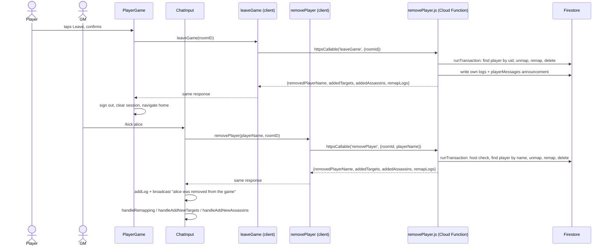

# Player Leave and Kick Implementation Plan

> **For agentic workers:** REQUIRED SUB-SKILL: Use superpowers:subagent-driven-development (recommended) or superpowers:executing-plans to implement this plan task-by-task. Steps use checkbox (`- [ ]`) syntax for tracking.

**Goal:** A player can permanently leave a game (self-service, with a
confirmation prompt), and a moderator can permanently remove a player
mid-game via a new `/kick <player>` command — both fully unmap the player
from the target graph, reassign whoever that leaves short, and delete
their document, mirroring `killPlayer.js`'s atomic transaction pattern.

**Architecture:** One new Cloud Function file, `removePlayer.js`, with two
`onCall` exports (`leaveGame`, `removePlayer`) sharing one internal
transaction step that mirrors `killPlayer.js`'s unmap-then-remap section
minus the kill-specific score transfer and `isAlive` reset. `leaveGame`
additionally writes its own GM-log and player-broadcast announcement
inside its own transaction — the player's browser has no Firestore write
permission to do this itself (`firestore.rules`'s `logs`/`playerMessages`
match blocks are host-only) — while `removePlayer` stays silent and lets
`ChatInput.js` (the host's own browser) announce afterward, exactly like
`/kill` already does.

**Tech Stack:** Firebase Cloud Functions (Admin SDK, `onCall`), Firestore
transactions, React/Chakra UI, Jest (`node`/`jsdom`/`integration` projects
per `jest.config.js`).

**Spec:** `docs/superpowers/specs/2026-08-29-player-leave-and-kick-design.md`

## Global Constraints

- Run all four gate commands before considering any task done:
  `npm run format`, `npm run lint` (fails on any warning), `npm test`,
  `npm run build`. Task 1 additionally requires `npm run test:emulator`
  (it is the only task touching a Cloud Function).
- The Admin SDK's `FieldValue` must be imported from `'firebase-admin/firestore'`,
  never `admin.firestore.FieldValue` — the Functions emulator strips static
  properties off the top-level `admin.firestore` binding, breaking
  `FieldValue.arrayUnion`/`serverTimestamp`/etc. under `npm run test:emulator`
  even though it resolves fine outside the emulator (see `joinRoom.js`'s and
  `undoMissionCompletion.js`'s identical comments on this).
- No new vendoring needed: `functions/scripts/sync-shared-game-logic.js`'s
  `FILES` array already includes `remapPlan.js` and `playerNames.js` (for
  `killPlayer.js`'s own use) — `removePlayer.js` needs nothing beyond
  those two.
- No new Firestore fields anywhere. This feature only deletes documents
  (the removed player's own) and writes to fields that already exist.
- No undo, no confirmation dialog for `/kick`, no moderator-facing button
  UI beyond the command bar. If you find yourself adding any of these,
  stop — they are explicit Out-of-scope items in the spec, not omissions.
- `leaveGame` announces itself server-side (writes its own `logs` and
  `playerMessages` entries inside its transaction); `removePlayer` does
  not (the caller announces afterward, like `/kill`). Do not make these
  symmetric — this is the one place this feature deviates from every
  other Cloud Function in this codebase, and it is easy to "fix" by
  accident into looking like `killPlayer.js`/`completeMission.js`'s
  return-data-only shape.

---

## Task 1: `removePlayer.js` Cloud Function

**Files:**

- Create: `functions/callableFunctions/removePlayer.js`
- Create: `src/components/removePlayerCallable.integration.test.js`
- Modify: `functions/index.js`
- Modify: `docs/testing.md:67-77` (emulator suite count and enumeration)

**Interfaces:**

- Produces: two `onCall` Cloud Functions, `leaveGame` and `removePlayer`.
    - `leaveGame({roomId})` → `{removedPlayerName, addedTargets, addedAssassins, remapLogs}`.
      Resolves which player to remove from `context.auth.uid` — no
      `playerName` argument. Also writes a `logs` entry and a
      `playerMessages` (`type: 'broadcast'`) entry inside the same
      transaction.
    - `removePlayer({roomId, playerName})` → same return shape, no
      announcement writes. Host-only.
    - Both throw `HttpsError`s: `unauthenticated` (no `context.auth`),
      `invalid-argument` (missing `roomId`, or missing `playerName` for
      `removePlayer`), `not-found` (room doesn't exist; for `leaveGame`, the
      caller's uid has no matching player doc; for `removePlayer`, no player
      matches the given name), `permission-denied` (`removePlayer` called by
      a non-host).
- Task 2 (the client wrappers) consumes both callable names verbatim.

- [ ] **Step 1: Write the failing emulator test file**

This test file lives under `src/components/` (not `functions/callableFunctions/`)
to match this codebase's actual convention — every existing Cloud Function
integration test does (`executeKill.integration.test.js`,
`joinRoom.integration.test.js`, `completeMissionCallable.integration.test.js`,
etc.), named after what it exercises via `httpsCallable`, not after the
Cloud Function's own file location.

Create `src/components/removePlayerCallable.integration.test.js`:

```js
/**
 * Layer 1b — the atomic player-removal Cloud Functions, against the real
 * Functions, Firestore, and Auth emulators together.
 *
 * Run with `npm run test:emulator`. `leaveGame` and `removePlayer` are thin
 * wrappers around `httpsCallable(functions, ...)` — these tests call them
 * exactly the way the real app does, then assert on what actually landed
 * in Firestore (docs/superpowers/specs/2026-08-29-player-leave-and-kick-design.md).
 */
import { leaveGame } from './leaveGame';
import { removePlayer } from './removePlayer';
import { fetchPlayerForRoom } from './firebase_calls/dbCalls';
import { auth, db } from '../utils/firebase';
import { collection, getDocs } from 'firebase/firestore';
import { callableAsNonHost, clearFirestore, seedRoom, shutdown } from '../../test/emulatorHelpers';

const ROOM = 'test-room';

beforeEach(clearFirestore);
afterAll(shutdown);

// leaveGame resolves which player to remove from the caller's own uid, so
// every "successful leave" test needs a seeded player whose uid matches
// whoever is actually signed in when the test calls the real leaveGame
// wrapper — the shared singleton `auth`/`db` from utils/firebase, the
// same one seedRoom signs in as host on its first call in this file
// (mirrors joinRoom.integration.test.js's own use of `auth.currentUser.uid`,
// read only after an earlier seedRoom call has guaranteed sign-in
// happened). A second seedRoom call is what adds that player, since
// auth.currentUser is still null at the time of the very first seedRoom
// call in a fresh test file run.
describe('leaveGame', () => {
    it("removes the caller's own document and reassigns whoever that leaves short", async () => {
        await seedRoom(ROOM, [
            { name: 'bob', targets: [], assassins: ['alice'] },
            { name: 'carol', targets: ['alice'], assassins: [] },
        ]);
        await seedRoom(ROOM, [
            { name: 'alice', uid: auth.currentUser.uid, targets: ['bob'], assassins: ['carol'] },
        ]);

        const result = await leaveGame(ROOM);

        expect(result.removedPlayerName).toBe('alice');
        await expect(fetchPlayerForRoom('alice', ROOM)).rejects.toThrow('Player not found');

        // alice's old target (bob) needed a new assassin; alice's old
        // assassin (carol) needed a new target — both should now point at
        // each other, the only other two players left.
        expect((await fetchPlayerForRoom('bob', ROOM)).data().assassins).toEqual(['carol']);
        expect((await fetchPlayerForRoom('carol', ROOM)).data().targets).toEqual(['bob']);
        expect(result.addedTargets.carol).toEqual(['bob']);
        expect(result.addedAssassins.bob).toEqual(['carol']);
    });

    it('writes a logs entry and a broadcast playerMessages entry naming the departed player', async () => {
        await seedRoom(ROOM, []);
        await seedRoom(ROOM, [{ name: 'alice', uid: auth.currentUser.uid }]);

        await leaveGame(ROOM);

        const logsSnapshot = await getDocs(collection(db, 'rooms', ROOM, 'logs'));
        expect(logsSnapshot.docs).toHaveLength(1);
        expect(logsSnapshot.docs[0].data()).toMatchObject({
            log: 'alice left the game',
            color: 'gray.400',
        });

        const messagesSnapshot = await getDocs(collection(db, 'rooms', ROOM, 'playerMessages'));
        expect(messagesSnapshot.docs).toHaveLength(1);
        expect(messagesSnapshot.docs[0].data()).toMatchObject({
            type: 'broadcast',
            recipient: null,
            text: 'alice left the game',
            standings: null,
        });
    });

    it('succeeds and does nothing but delete the document before the game starts (empty target graph)', async () => {
        await seedRoom(ROOM, [{ name: 'bob' }]);
        await seedRoom(ROOM, [{ name: 'alice', uid: auth.currentUser.uid }]);

        const result = await leaveGame(ROOM);

        expect(result.addedTargets).toEqual({});
        expect(result.addedAssassins).toEqual({});
        expect(result.remapLogs).toEqual([]);
        await expect(fetchPlayerForRoom('alice', ROOM)).rejects.toThrow('Player not found');
        expect((await fetchPlayerForRoom('bob', ROOM)).data()).toBeDefined();
    });

    it('rejects a caller whose uid never joined this room, writing nothing', async () => {
        // alice is seeded without a uid override, so her doc's uid never
        // matches whoever seedRoom itself just signed in as (the host) —
        // the same "no matching player doc" state leaveGame must reject.
        await seedRoom(ROOM, [{ name: 'alice' }]);

        await expect(leaveGame(ROOM)).rejects.toThrow('You have not joined this room.');
        expect((await fetchPlayerForRoom('alice', ROOM)).data()).toBeDefined();
    });

    it('rejects a room that does not exist', async () => {
        // seedRoom (for an unrelated room) is what actually signs in the
        // shared auth singleton the first time — calling it here keeps
        // this test self-contained rather than relying on an earlier test
        // in the file to have done so first, matching every test in
        // joinRoom.integration.test.js.
        await seedRoom('some-other-room', []);

        await expect(leaveGame('nonexistent-room')).rejects.toThrow(
            'Room not found: nonexistent-room'
        );
    });
});

describe('removePlayer', () => {
    it('requires the caller to be host', async () => {
        await seedRoom(ROOM, [{ name: 'alice' }]);
        const removePlayerAsNonHost = callableAsNonHost('removePlayer');

        await expect(removePlayerAsNonHost({ roomId: ROOM, playerName: 'alice' })).rejects.toThrow(
            /permission-denied|host/i
        );
        expect((await fetchPlayerForRoom('alice', ROOM)).data()).toBeDefined();
    });

    it("removes the named player's document and reassigns whoever that leaves short, as the host", async () => {
        await seedRoom(ROOM, [
            { name: 'alice', targets: ['bob'], assassins: ['carol'] },
            { name: 'bob', targets: [], assassins: ['alice'] },
            { name: 'carol', targets: ['alice'], assassins: [] },
        ]);

        const result = await removePlayer('alice', ROOM);

        expect(result.removedPlayerName).toBe('alice');
        await expect(fetchPlayerForRoom('alice', ROOM)).rejects.toThrow('Player not found');
        expect((await fetchPlayerForRoom('bob', ROOM)).data().assassins).toEqual(['carol']);
        expect((await fetchPlayerForRoom('carol', ROOM)).data().targets).toEqual(['bob']);
    });

    it('writes no logs or playerMessages entries of its own', async () => {
        await seedRoom(ROOM, [{ name: 'alice' }]);

        await removePlayer('alice', ROOM);

        const logsSnapshot = await getDocs(collection(db, 'rooms', ROOM, 'logs'));
        expect(logsSnapshot.docs).toHaveLength(0);
        const messagesSnapshot = await getDocs(collection(db, 'rooms', ROOM, 'playerMessages'));
        expect(messagesSnapshot.docs).toHaveLength(0);
    });

    it('rejects a player name that does not exist, writing nothing', async () => {
        await seedRoom(ROOM, [{ name: 'alice' }]);

        await expect(removePlayer('nobody', ROOM)).rejects.toThrow('Player not found: nobody');
        expect((await fetchPlayerForRoom('alice', ROOM)).data()).toBeDefined();
    });

    it('succeeds before the game starts (empty target graph), removing only the document', async () => {
        await seedRoom(ROOM, [{ name: 'alice' }, { name: 'bob' }]);

        const result = await removePlayer('alice', ROOM);

        expect(result.addedTargets).toEqual({});
        expect(result.addedAssassins).toEqual({});
        expect(result.remapLogs).toEqual([]);
        await expect(fetchPlayerForRoom('alice', ROOM)).rejects.toThrow('Player not found');
    });
});
```

- [ ] **Step 2: Run the tests to verify they fail**

Run: `npm run test:emulator -- --testPathPattern=removePlayerCallable`
Expected: FAIL — `Cannot find module './leaveGame'` (Task 2 doesn't exist
yet) or a Functions-emulator "no such function" error, since neither
`leaveGame` nor `removePlayer` exist as callables yet. If the module
resolution error blocks the whole file from running, that's an acceptable
"fails for the right reason" — the point is nothing here can pass yet.

- [ ] **Step 3: Write `functions/callableFunctions/removePlayer.js`**

```js
const functions = require('firebase-functions');
const admin = require('firebase-admin');
// Imported from the firestore subpath, not admin.firestore.FieldValue —
// see joinRoom.js's/undoMissionCompletion.js's identical comment for why
// (the Functions emulator strips static properties off the top-level
// admin.firestore binding).
const { FieldValue } = require('firebase-admin/firestore');
const { planRemap } = require('../vendor/game/remapPlan');
const { normalizePlayerName } = require('../vendor/game/playerNames');

if (admin.apps.length === 0) {
    admin.initializeApp();
}

const db = admin.firestore();

/**
 * The shared removal step both leaveGame and removePlayer call: unmaps
 * playerDoc from the target graph — mirrors killPlayer.js's unmap-then-
 * remap section exactly, minus the score-transfer and isAlive/openSeason
 * reset pieces, which are kill-specific — then deletes the player's own
 * document instead of updating it
 * (docs/superpowers/specs/2026-08-29-player-leave-and-kick-design.md).
 */
const removeAndRemap = async (transaction, roomRef, playerDoc) => {
    const playersRef = roomRef.collection('players');
    const playerData = playerDoc.data();
    const playerKey = normalizePlayerName(playerData.name);

    // The removed player's former hunters and prey — these need
    // unmapping. Deduped by normalized name, same reasoning as
    // killPlayer.js: a stale reference to a since-deleted player
    // shouldn't block this removal, so it's skipped, not thrown.
    const neighborNames = [...(playerData.assassins || []), ...(playerData.targets || [])];
    const neighborDocsByName = new Map();
    for (const name of neighborNames) {
        const key = normalizePlayerName(name);
        if (neighborDocsByName.has(key)) continue;
        const neighborSnapshot = await transaction.get(
            playersRef.where('trimmedNameLowerCase', '==', key)
        );
        if (neighborSnapshot.empty) {
            console.warn(`removePlayer: neighbor not found, skipping unmap: ${name}`);
            continue;
        }
        neighborDocsByName.set(key, neighborSnapshot.docs[0]);
    }

    // The alive roster for the remap step, as planRemap expects it: the
    // removed player excluded (their deletion write hasn't landed yet
    // within this transaction) and scrubbed from every neighbor's own
    // targets/assassins arrays (their unmap write hasn't landed yet
    // either) — identical reasoning to killPlayer.js's own roster read.
    const rosterSnapshot = await transaction.get(playersRef.where('isAlive', '==', true));
    const rosterDocsByName = new Map();
    const roster = [];
    for (const doc of rosterSnapshot.docs) {
        const docData = doc.data();
        if (docData.trimmedNameLowerCase === playerKey) continue;
        rosterDocsByName.set(normalizePlayerName(docData.name), doc);
        roster.push({
            name: docData.name,
            targets: (docData.targets || []).filter(
                (name) => normalizePlayerName(name) !== playerKey
            ),
            assassins: (docData.assassins || []).filter(
                (name) => normalizePlayerName(name) !== playerKey
            ),
        });
    }

    const plan = planRemap(roster, {
        needTargets: playerData.assassins || [],
        needAssassins: playerData.targets || [],
    });

    // --- write phase ---

    const pendingUpdates = new Map();
    const queueUpdate = (name, ref, fields) => {
        const key = normalizePlayerName(name);
        const existing = pendingUpdates.get(key);
        if (existing) {
            Object.assign(existing.fields, fields);
        } else {
            pendingUpdates.set(key, { ref, fields: { ...fields } });
        }
    };

    for (const name of playerData.assassins || []) {
        const neighborDoc = neighborDocsByName.get(normalizePlayerName(name));
        if (!neighborDoc) continue;
        const newTargets = (neighborDoc.data().targets || []).filter(
            (n) => normalizePlayerName(n) !== playerKey
        );
        queueUpdate(name, neighborDoc.ref, { targets: newTargets });
    }
    for (const name of playerData.targets || []) {
        const neighborDoc = neighborDocsByName.get(normalizePlayerName(name));
        if (!neighborDoc) continue;
        const newAssassins = (neighborDoc.data().assassins || []).filter(
            (n) => normalizePlayerName(n) !== playerKey
        );
        queueUpdate(name, neighborDoc.ref, { assassins: newAssassins });
    }

    for (const write of plan.writes) {
        const doc = rosterDocsByName.get(normalizePlayerName(write.player));
        if (!doc) continue; // defensive; every plan.writes entry came from `roster`
        queueUpdate(write.player, doc.ref, {
            targets: write.targets,
            assassins: write.assassins,
        });
    }

    for (const { ref, fields } of pendingUpdates.values()) {
        transaction.update(ref, fields);
    }

    transaction.delete(playerDoc.ref);

    return {
        removedPlayerName: playerData.name,
        addedTargets: plan.added.targets,
        addedAssassins: plan.added.assassins,
        remapLogs: plan.logs,
    };
};

/**
 * Removes the calling player from the room for good — self-service.
 * Resolves which player to remove from the caller's own uid, so a player
 * can only ever remove themselves. Announces the departure itself (a
 * logs entry and a broadcast playerMessages entry, inside this same
 * transaction) since firestore.rules restricts both collections to
 * `isHostOfExistingRoom` — a player's own browser cannot write either
 * directly, the same reason submitChatMessage.js/submitKillPhoto.js had
 * to move player-initiated writes behind the Admin SDK.
 */
exports.leaveGame = functions.https.onCall(async (data, context) => {
    if (!context.auth) {
        throw new functions.https.HttpsError(
            'unauthenticated',
            'The function must be called while authenticated.'
        );
    }

    const { roomId } = data;
    if (!roomId) {
        throw new functions.https.HttpsError('invalid-argument', 'roomId is required.');
    }

    return db.runTransaction(async (transaction) => {
        const roomRef = db.collection('rooms').doc(roomId);
        const playersRef = roomRef.collection('players');

        const roomSnapshot = await transaction.get(roomRef);
        if (!roomSnapshot.exists) {
            throw new functions.https.HttpsError('not-found', `Room not found: ${roomId}`);
        }

        const playerSnapshot = await transaction.get(
            playersRef.where('uid', '==', context.auth.uid)
        );
        if (playerSnapshot.empty) {
            throw new functions.https.HttpsError('not-found', 'You have not joined this room.');
        }
        const playerDoc = playerSnapshot.docs[0];

        const result = await removeAndRemap(transaction, roomRef, playerDoc);

        const logRef = roomRef.collection('logs').doc();
        transaction.set(logRef, {
            time: new Date().toLocaleTimeString(),
            log: `${result.removedPlayerName} left the game`,
            color: 'gray.400',
            timestamp: FieldValue.serverTimestamp(),
        });

        const messageRef = roomRef.collection('playerMessages').doc();
        transaction.set(messageRef, {
            type: 'broadcast',
            recipient: null,
            text: `${result.removedPlayerName} left the game`,
            standings: null,
            timestamp: FieldValue.serverTimestamp(),
        });

        return result;
    });
});

/**
 * Removes a named player from the room for good — host-only, powers the
 * console's `/kick <player>` command. Writes only the shared removal
 * fields; unlike leaveGame, this does not announce anything itself — the
 * host's own, already-privileged browser (ChatInput.js) logs and
 * broadcasts after the call succeeds, exactly like `/kill` already does.
 */
exports.removePlayer = functions.https.onCall(async (data, context) => {
    if (!context.auth) {
        throw new functions.https.HttpsError(
            'unauthenticated',
            'The function must be called while authenticated.'
        );
    }

    const { roomId, playerName } = data;
    if (!roomId || !playerName) {
        throw new functions.https.HttpsError(
            'invalid-argument',
            'roomId and playerName are both required.'
        );
    }

    return db.runTransaction(async (transaction) => {
        const roomRef = db.collection('rooms').doc(roomId);
        const playersRef = roomRef.collection('players');

        const roomSnapshot = await transaction.get(roomRef);
        if (!roomSnapshot.exists) {
            throw new functions.https.HttpsError('not-found', `Room not found: ${roomId}`);
        }
        if (roomSnapshot.data().hostId !== context.auth.uid) {
            throw new functions.https.HttpsError(
                'permission-denied',
                'Only the room host can remove a player.'
            );
        }

        const playerSnapshot = await transaction.get(
            playersRef.where('trimmedNameLowerCase', '==', normalizePlayerName(playerName))
        );
        if (playerSnapshot.empty) {
            throw new functions.https.HttpsError('not-found', `Player not found: ${playerName}`);
        }
        const playerDoc = playerSnapshot.docs[0];

        return removeAndRemap(transaction, roomRef, playerDoc);
    });
});
```

- [ ] **Step 4: Register both exports in `functions/index.js`**

Add, following the file's existing require/exports pattern exactly
(double-quoted requires, no semicolons after the `exports.X = X` lines —
match the surrounding style, not your editor's default):

```js
const { leaveGame, removePlayer } = require('./callableFunctions/removePlayer');
exports.leaveGame = leaveGame;
exports.removePlayer = removePlayer;
```

Insert this block after the `completeMission`/`undoMissionCompletion`
block and before the `cleanupEndedRooms` block.

- [ ] **Step 5: Sync vendored files and run the emulator tests**

Run: `node functions/scripts/sync-shared-game-logic.js` (confirms
`remapPlan.js`/`playerNames.js` are present in `functions/vendor/game/` —
no `FILES` array change needed, this just regenerates the existing copies)

Run: `npm run test:emulator -- --testPathPattern=removePlayerCallable`
Expected: PASS, all tests green.

- [ ] **Step 6: Run the full gate**

```bash
npm run format
npm run lint
npm test
npm run build
npm run test:emulator
```

All five must be clean. `npm run test:emulator` runs the full suite (not
just this new file) — confirm no regressions elsewhere.

- [ ] **Step 7: Update `docs/testing.md`'s emulator suite enumeration**

Read the current state of `docs/testing.md:67-77` fresh — it currently
reads "ten further suites" ending in "... and `undoMissionCompletionCallable.integration.test.js`
(10 tests), 95 tests" (or whatever the exact current numbers are; the file
may have shifted since this plan was written). Update it to:

1. Change "ten further suites" to "eleven further suites".
2. Add `removePlayerCallable.integration.test.js` to the list, with its
   actual test count (count the `it(` calls in the file you just wrote —
   9 as drafted above, but verify against what actually landed after
   Step 6's gate run, in case a step above needed adjustment).
3. Add a new row to the suite table further down the file (mirroring
   `executeKill.integration.test.js`'s row format) describing what this
   suite covers: "The `leaveGame` and `removePlayer` Cloud Functions via
   `httpsCallable` (player-leave-and-kick): both fully unmap the removed
   player from the target graph and reassign whoever that leaves short;
   `leaveGame` resolves the caller's own uid and additionally writes its
   own `logs`/`playerMessages` announcement (the player's browser cannot
   write either directly); `removePlayer` is host-only and writes neither;
   not-found/permission-denied on every invalid input, writing nothing."
4. Update the running total test count at the end of that sentence
   (currently 95 — add this suite's actual count).

- [ ] **Step 8: Commit**

```bash
git add functions/callableFunctions/removePlayer.js \
    src/components/removePlayerCallable.integration.test.js \
    functions/index.js docs/testing.md
git commit -m "Add leaveGame and removePlayer Cloud Functions"
```

---

## Task 2: Client wrappers

**Files:**

- Create: `src/components/leaveGame.js`
- Create: `src/components/removePlayer.js`

**Interfaces:**

- Consumes: the `leaveGame` and `removePlayer` callables from Task 1.
- Produces: `leaveGame(roomID)` and `removePlayer(playerName, roomID)`,
  both async, resolving to `{removedPlayerName, addedTargets, addedAssassins, remapLogs}`
  on success and rejecting with a real `.message` on failure. Task 4 and
  Task 5 both import these by these exact names.

- [ ] **Step 1: Write `src/components/leaveGame.js`**

```js
import { httpsCallable } from 'firebase/functions';
import { functions } from '../utils/firebase';

const leaveGameCallable = httpsCallable(functions, 'leaveGame');

/**
 * Removes the calling player from the room for good — unmaps them from
 * the target graph, reassigns whoever that leaves short, deletes their
 * player document, and announces the departure
 * (docs/superpowers/specs/2026-08-29-player-leave-and-kick-design.md).
 * The server resolves which player to remove from the caller's own uid —
 * no argument for it.
 *
 * @throws if the caller hasn't joined this room — surfaces as a rejected
 *   promise carrying `.message`.
 */
export const leaveGame = async (roomID) => {
    const { data } = await leaveGameCallable({ roomId: roomID });
    return data;
};
```

- [ ] **Step 2: Write `src/components/removePlayer.js`**

```js
import { httpsCallable } from 'firebase/functions';
import { functions } from '../utils/firebase';

const removePlayerCallable = httpsCallable(functions, 'removePlayer');

/**
 * Removes a named player from the room for good, moderator-initiated —
 * the same unmap/remap/delete `leaveGame` performs, minus the
 * self-announcement (the caller, the host's own browser, announces it
 * afterward — see ChatInput.js's `/kick` case)
 * (docs/superpowers/specs/2026-08-29-player-leave-and-kick-design.md).
 *
 * @throws if playerName doesn't match anyone in the room, or the caller
 *   isn't the room's host — surfaces as a rejected promise carrying
 *   `.message`.
 */
export const removePlayer = async (playerName, roomID) => {
    const { data } = await removePlayerCallable({ playerName, roomId: roomID });
    return data;
};
```

These two files have no dedicated unit test — mirrors `executeKill.js`/
`undoKill.js`'s own precedent (no `executeKill.test.js` exists; the thin
wrapper is exercised only by the integration test in Task 1 and, once
Task 4/Task 5 land, by the component tests that mock it).

- [ ] **Step 3: Run the full gate**

```bash
npm run format
npm run lint
npm test
npm run build
```

- [ ] **Step 4: Commit**

```bash
git add src/components/leaveGame.js src/components/removePlayer.js
git commit -m "Add leaveGame and removePlayer client wrappers"
```

---

## Task 3: `/kick` parsing and tab-completion

Fully independent of Tasks 1 and 2 — this is pure parsing/completion
logic with no Firebase calls. Can run anytime, in parallel with any other
task.

**Files:**

- Modify: `src/game/commands.js:10-19` (`KNOWN_COMMANDS`)
- Modify: `src/game/commandCompletion.js:25-33` (`ARG_LABELS`),
  `src/game/commandCompletion.js:139-180` (`candidatesForSlot`'s `switch`)
- Modify: `src/game/commandCompletion.test.js:15-27` (fixes a test this
  change breaks — see Step 1) and adds new `/kick` coverage
- Test: `src/game/commands.test.js` (extended, if this file exists — it
  covers `KNOWN_COMMANDS`/`parseCommand`; check for it and extend rather
  than assuming its absence)

**Interfaces:**

- Produces: `/kick` is a member of `KNOWN_COMMANDS`, so `parseCommand('/kick alice')`
  returns `{ok: true, command: '/kick', args: ['alice']}`. Tab-completion
  for `/kick`'s first (only) argument slot offers the live player roster,
  the same shape `/whisper`'s single-slot completion already returns.
- Task 4 consumes `KNOWN_COMMANDS` including `/kick` (so `parseCommand`
  accepts it at all) and expects no completion changes beyond what's
  described here — `ChatInput.js` doesn't call `commandCompletion`
  directly for execution, only for the suggestion dropdown.

- [ ] **Step 1: Write the failing tests**

Adding `/kick` to `KNOWN_COMMANDS` changes an existing test's outcome:
`src/game/commandCompletion.test.js`'s first test (around line 17) asserts
`complete('/ki', {})` uniquely completes to `/kill`, because today `/kill`
is the only known command starting with `/ki`. Once `/kick` exists,
`/ki` matches both `/kick` and `/kill` (they diverge at the third
character — `c` vs `l`), so this test's premise breaks. Fix it in place
to use an unambiguous prefix, and add a new test proving the now-ambiguous
`/ki` case resolves correctly:

Replace this existing test:

```js
it('completes a unique command word', () => {
    const result = complete('/ki', {});
    expect(result).toEqual({
        applied: true,
        tokenStart: 0,
        tokenEnd: 3,
        commonPrefix: '/kill',
        candidates: ['/kill'],
        suggestionLines: ['/kill [player_name] [assassin_name]'],
        isUnique: true,
    });
});
```

with:

```js
it('completes a unique command word', () => {
    const result = complete('/kil', {});
    expect(result).toEqual({
        applied: true,
        tokenStart: 0,
        tokenEnd: 4,
        commonPrefix: '/kill',
        candidates: ['/kill'],
        suggestionLines: ['/kill [player_name] [assassin_name]'],
        isUnique: true,
    });
});

it('completes to the longest common prefix between /kick and /kill when ambiguous', () => {
    const result = complete('/ki', {});
    expect(result.applied).toBe(true);
    expect(result.isUnique).toBe(false);
    expect(result.commonPrefix).toBe('/ki');
    expect(result.candidates.sort()).toEqual(['/kick', '/kill']);
});
```

Then add a new describe block for `/kick`'s own argument slot, mirroring
`/whisper`'s single-slot test shape (`commandCompletion.test.js:153-164`).
Insert this after the existing `describe('complete — /whisper', ...)`
block:

```js
describe('complete — /kick', () => {
    it('completes the player slot', () => {
        const result = complete('/kick B', { players });
        expect(result.applied).toBe(true);
        expect(result.commonPrefix).toBe('Bob');
    });

    it('offers every player when nothing has been typed yet', () => {
        const result = complete('/kick ', { players });
        expect(result.applied).toBe(true);
        expect(result.candidates).toEqual(['Alice Smith', 'Alex', 'Bob']);
    });
});
```

- [ ] **Step 2: Run the tests to verify they fail**

Run: `npx jest src/game/commandCompletion.test.js -v`
Expected: the two new `/kick`-slot tests FAIL (`/kick` isn't a known
command yet, so `complete` returns `{applied: false}`); the "ambiguous
`/ki`" test FAILS too (still resolves uniquely to `/kill` until `/kick`
exists); the renamed "unique command word" test (`/kil`) should already
PASS even before any code change, since `/kil` is unaffected by `/kick`'s
absence — that's expected and fine, it's the two new/changed behaviors
that must fail here, not every edited line.

- [ ] **Step 3: Add `/kick` to `KNOWN_COMMANDS`**

In `src/game/commands.js`, insert `'/kick'` before `'/kill'` (the array is
alphabetically ordered; `/kick` sorts before `/kill`):

```js
export const KNOWN_COMMANDS = [
    '/add',
    '/broadcast',
    '/kick',
    '/kill',
    '/leaderboard',
    '/mission',
    '/openseason',
    '/revive',
    '/whisper',
];
```

- [ ] **Step 4: Add `/kick` to `commandCompletion.js`'s `ARG_LABELS` and `candidatesForSlot`**

In `ARG_LABELS` (`src/game/commandCompletion.js:25-33`), add an entry —
insert it after `'/add'`:

```js
const ARG_LABELS = {
    '/add': ['[player_name]', '[points]'],
    '/kick': ['[player_name]'],
    '/kill': ['[player_name]', '[assassin_name]'],
    '/openseason': ['[player_name]', 'start/end'],
    '/revive': ['[player_name]'],
    '/whisper': ['[player_name]', '[message]'],
    '/broadcast': ['[message]'],
    '/leaderboard': ['send'],
};
```

In `candidatesForSlot`'s `switch` (`src/game/commandCompletion.js:139-180`),
add a case mirroring `/whisper`'s single-argument shape (not `/kill`'s
two-argument shape) — insert it right after `case '/add':`:

```js
        case '/kick':
            return slotIndex === 1 ? playerNames(players) : null;
```

- [ ] **Step 5: Run the tests to verify they pass**

Run: `npx jest src/game/commandCompletion.test.js -v`
Expected: PASS, all tests green including the renamed/new ones above.

Also run: `npx jest src/game/commands.test.js -v` (if this file exists —
`KNOWN_COMMANDS` gaining an entry shouldn't break any existing assertion
there, but confirm).

- [ ] **Step 6: Run the full gate**

```bash
npm run format
npm run lint
npm test
npm run build
```

- [ ] **Step 7: Commit**

```bash
git add src/game/commands.js src/game/commandCompletion.js src/game/commandCompletion.test.js
git commit -m "Add /kick to command parsing and tab-completion"
```

---

## Task 4: `/kick` in `ChatInput.js`

**Files:**

- Modify: `src/components/logs_components/ChatInput.js` (add `import { removePlayer } from '../removePlayer';`
  near the other wrapper imports at the top, and a new `case '/kick':`
  in `handleCommandExecution`'s `switch`)
- Modify: `src/components/logs_components/ChatInput.test.jsx`

**Interfaces:**

- Consumes: `removePlayer(playerName, roomID)` from Task 2 (must exist as
  a real module for the mock in the test file below to have something
  real to mock against, though the test itself only ever sees the mock);
  `'/kick'` must be in `KNOWN_COMMANDS` from Task 3 for `parseCommand` to
  accept it at all — write and run this task's tests only after Task 3 has
  landed.
- Produces: nothing new for later tasks — this is the command bar's
  execution wiring, the last piece of the moderator-facing path.

- [ ] **Step 1: Write the failing tests**

In `src/components/logs_components/ChatInput.test.jsx`, add the import and
mock alongside the existing `executeKill` ones near the top of the file:

```js
import { removePlayer } from '../removePlayer';
```

```js
jest.mock('../removePlayer', () => ({ removePlayer: jest.fn() }));
```

In the `beforeEach` block, add a default resolution alongside the
existing `executeKill.mockResolvedValue(...)`:

```js
removePlayer.mockResolvedValue({
    removedPlayerName: 'Bob',
    addedTargets: {},
    addedAssassins: {},
    remapLogs: [],
});
```

Add a new `describe` block, mirroring the `/kill` describe block's
structure and mocking conventions exactly
(`ChatInput.test.jsx:121-152`ish — read that block fresh before writing
these, since `mountChatInput`/`typeAndSubmit`/`executionHandlers` are
already defined above it in the file and these tests reuse them):

```js
describe('/kick', () => {
    it('normalizes the name and routes the response to the remap handlers', async () => {
        removePlayer.mockResolvedValue({
            removedPlayerName: 'Bob',
            addedTargets: { alice: ['carol'] },
            addedAssassins: { carol: ['alice'] },
            remapLogs: ['New target for alice: carol'],
        });
        const commandInput = mountChatInput();
        typeAndSubmit(commandInput, '/kick bob');

        await waitFor(() => expect(removePlayer).toHaveBeenCalledWith('bob', 'room-a'));
        expect(executionHandlers.addLog).toHaveBeenCalledWith(
            'Bob was removed from the game',
            'gray.400'
        );
        expect(dbCalls.addPlayerMessageForRoom).toHaveBeenCalledWith(
            {
                type: 'broadcast',
                recipient: null,
                text: 'Bob was removed from the game',
                standings: null,
            },
            'room-a'
        );
        expect(executionHandlers.handleRemapping).toHaveBeenCalledWith(
            'New target for alice: carol'
        );
        expect(executionHandlers.handleAddNewAssassins).toHaveBeenCalledWith({
            carol: ['alice'],
        });
        expect(executionHandlers.handleAddNewTargets).toHaveBeenCalledWith({ alice: ['carol'] });
        expect(executionHandlers.handleSetShowMessageToTrue).toHaveBeenCalled();
    });

    it('rejects a name not on the roster without calling removePlayer', async () => {
        const commandInput = mountChatInput();
        typeAndSubmit(commandInput, '/kick nobody');

        await waitFor(() =>
            expect(screen.getByText(/Player nobody is invalid/)).toBeInTheDocument()
        );
        expect(removePlayer).not.toHaveBeenCalled();
    });

    it('normalizes a name with an internal space before calling removePlayer', async () => {
        const commandInput = mountChatInput([
            { name: 'Alice Smith', isAlive: true },
            { name: 'Bob', isAlive: true },
        ]);
        typeAndSubmit(commandInput, '/kick [Alice Smith]');

        await waitFor(() => expect(removePlayer).toHaveBeenCalledWith('alicesmith', 'room-a'));
    });
});

describe('a rejected removePlayer surfaces as a toast', () => {
    it('shows the error and never logs or broadcasts', async () => {
        removePlayer.mockRejectedValue(new Error('Player not found: bob'));
        const commandInput = mountChatInput();
        typeAndSubmit(commandInput, '/kick bob');

        await waitFor(() =>
            expect(screen.getByText(/\/kick failed: Player not found: bob/)).toBeInTheDocument()
        );
        expect(executionHandlers.addLog).not.toHaveBeenCalled();
        expect(dbCalls.addPlayerMessageForRoom).not.toHaveBeenCalled();
    });
});
```

- [ ] **Step 2: Run the tests to verify they fail**

Run: `npx jest src/components/logs_components/ChatInput.test.jsx -t "kick" -v`
Expected: FAIL — `/kick` isn't a known command yet in this file's own
`handleCommandExecution` switch (even though `KNOWN_COMMANDS` accepts it
from Task 3, `ChatInput.js`'s switch falls through to `default:` and
shows "Unknown command: /kick").

- [ ] **Step 3: Add the import and the `case '/kick':`**

In `src/components/logs_components/ChatInput.js`, add the import near the
other wrapper imports (after `import { executeKill } from '../executeKill';`):

```js
import { removePlayer } from '../removePlayer';
```

Add a new `case '/kick':` in the main `switch (commandLine)` block,
mirroring `case '/kill':`'s structure (`ChatInput.js:121-152`) — insert it
right after the `case '/kill':` block's closing `break;`:

```js
            case '/kick':
                const kickPlayerName = args[0] ? normalizePlayerName(args[0]) : '';
                if (arrayOfPlayerNames.includes(kickPlayerName)) {
                    const result = await removePlayer(kickPlayerName, roomID);
                    const displayName = resolvePlayerDisplayName(kickPlayerName, players);

                    await addLog(`${displayName} was removed from the game`, 'gray.400');
                    await addPlayerMessageForRoom(
                        {
                            type: 'broadcast',
                            recipient: null,
                            text: `${displayName} was removed from the game`,
                            standings: null,
                        },
                        roomID
                    );

                    for (const log of result.remapLogs) {
                        await handleRemapping(log);
                    }
                    handleAddNewAssassins(result.addedAssassins);
                    handleAddNewTargets(result.addedTargets);
                    handleSetShowMessageToTrue();
                } else {
                    createAlert('error', 'Error', `Player ${args[0]} is invalid`, 1500);
                    console.error(`Player ${args[0]} is invalid.`);
                }
                break;
```

Note: unlike `/mission done`'s conditional remap-handler calls (only
called `if (result.revivesPlayer)`), `/kick` calls the remap handlers
unconditionally — matching `/kill`'s own unconditional call, since a
removal always potentially touches the graph (there's no "plain, no-remap"
variant of a removal the way a Task-type mission completion has no
revival). An empty `addedTargets`/`addedAssassins`/`remapLogs` (the
pre-game case) still opens the "New Targets" modal, same as it would for
a kill with no remap fallout — this mirrors existing `/kill` behavior
exactly, not a new inconsistency introduced here.

- [ ] **Step 4: Run the tests to verify they pass**

Run: `npx jest src/components/logs_components/ChatInput.test.jsx -v`
Expected: PASS, all tests in the file green (not just the new `/kick`
ones — confirm nothing else broke).

- [ ] **Step 5: Run the full gate**

```bash
npm run format
npm run lint
npm test
npm run build
```

- [ ] **Step 6: Commit**

```bash
git add src/components/logs_components/ChatInput.js src/components/logs_components/ChatInput.test.jsx
git commit -m "Add /kick command to the GM command bar"
```

---

## Task 5: "Leave" confirmation in `PlayerGame.js`

**Files:**

- Modify: `src/pages/PlayerGame.js`
- Modify: `src/pages/PlayerGame.test.jsx`

**Interfaces:**

- Consumes: `leaveGame(roomID)` from Task 2.
- Produces: nothing new for later tasks — this is the player-facing side
  of the feature, self-contained.

- [ ] **Step 1: Write the failing tests**

Read `src/pages/PlayerGame.test.jsx` fresh first — specifically the
existing test at line 199 ("signs out, clears the session, and navigates
home when Leave is clicked") and the file's top-level mock setup
(`jest.mock('firebase/auth', ...)`, `jest.mock('../components/firebase_calls/dbCalls', ...)`,
the `renderWaiting` helper). That existing test's premise (clicking
"Leave" immediately signs out) no longer holds once this task lands —
replace it, and add the new confirmation-flow tests around it.

Add the import and mock near the top of the file, alongside the existing
`dbCalls` mock:

```js
import { leaveGame } from '../components/leaveGame';
```

```js
jest.mock('../components/leaveGame', () => ({ leaveGame: jest.fn() }));
```

In the `beforeEach` block (where `signOut.mockResolvedValue(undefined);`
already lives, around line 96), add:

```js
leaveGame.mockResolvedValue({
    removedPlayerName: 'Alice',
    addedTargets: {},
    addedAssassins: {},
    remapLogs: [],
});
```

Replace the existing test at line 199:

```js
it('signs out, clears the session, and navigates home when Leave is clicked', async () => {
    writePlayerSession('Fluffy42317', 'Alice');
    onSnapshot.mockImplementation((ref, callback) => {
        if (ref === 'room-ref') {
            callback({ exists: () => true, data: () => ({ gameStarted: false }) });
        }
        return () => {};
    });

    renderWaiting();

    await userEvent.click(screen.getByRole('button', { name: 'Leave' }));

    expect(signOut).toHaveBeenCalled();
    expect(readPlayerSession()).toBeNull();
    expect(await screen.findByText('Home page')).toBeInTheDocument();
});
```

with:

```js
it('opens a confirmation dialog instead of leaving immediately', async () => {
    writePlayerSession('Fluffy42317', 'Alice');
    onSnapshot.mockImplementation((ref, callback) => {
        if (ref === 'room-ref') {
            callback({ exists: () => true, data: () => ({ gameStarted: false }) });
        }
        return () => {};
    });

    renderWaiting();

    await userEvent.click(screen.getByRole('button', { name: 'Leave' }));

    expect(
        screen.getByText("Leave the game? You'll be removed and cannot rejoin.")
    ).toBeInTheDocument();
    expect(leaveGame).not.toHaveBeenCalled();
});

it('calls leaveGame, signs out, clears the session, and navigates home once confirmed', async () => {
    writePlayerSession('Fluffy42317', 'Alice');
    onSnapshot.mockImplementation((ref, callback) => {
        if (ref === 'room-ref') {
            callback({ exists: () => true, data: () => ({ gameStarted: false }) });
        }
        return () => {};
    });

    renderWaiting();

    await userEvent.click(screen.getByRole('button', { name: 'Leave' }));
    await userEvent.click(screen.getByRole('button', { name: 'Confirm' }));

    expect(leaveGame).toHaveBeenCalledWith('Fluffy42317');
    expect(signOut).toHaveBeenCalled();
    expect(readPlayerSession()).toBeNull();
    expect(await screen.findByText('Home page')).toBeInTheDocument();
});

it('calls neither leaveGame nor signOut when Go Back is clicked', async () => {
    writePlayerSession('Fluffy42317', 'Alice');
    onSnapshot.mockImplementation((ref, callback) => {
        if (ref === 'room-ref') {
            callback({ exists: () => true, data: () => ({ gameStarted: false }) });
        }
        return () => {};
    });

    renderWaiting();

    await userEvent.click(screen.getByRole('button', { name: 'Leave' }));
    await userEvent.click(screen.getByRole('button', { name: 'Go Back' }));

    expect(leaveGame).not.toHaveBeenCalled();
    expect(signOut).not.toHaveBeenCalled();
    expect(readPlayerSession()).not.toBeNull();
});

it('shows an error and does not sign out when leaveGame is rejected', async () => {
    leaveGame.mockRejectedValue(new Error('You have not joined this room.'));
    writePlayerSession('Fluffy42317', 'Alice');
    onSnapshot.mockImplementation((ref, callback) => {
        if (ref === 'room-ref') {
            callback({ exists: () => true, data: () => ({ gameStarted: false }) });
        }
        return () => {};
    });

    renderWaiting();

    await userEvent.click(screen.getByRole('button', { name: 'Leave' }));
    await userEvent.click(screen.getByRole('button', { name: 'Confirm' }));

    expect(await screen.findByText('You have not joined this room.')).toBeInTheDocument();
    expect(signOut).not.toHaveBeenCalled();
    expect(readPlayerSession()).not.toBeNull();
});
```

The dialog's confirm button is labeled "Confirm," not "Leave" — every
existing confirmation dialog in this codebase
(`PlayerRemove.js`, `ResetTargetsButton.js`, `Endgamebutton.js`'s
"Confirm End Game", `TargetGenerator.js`'s "Confirm and Begin Game")
deliberately gives its trigger and confirm buttons different accessible
names, specifically so a test (and a screen reader) never has two
same-named "Leave" buttons in the DOM at once once the dialog opens —
Chakra's `AlertDialog` renders into a portal without hiding the trigger
behind it. Keep this distinction in Step 3's JSX below; do not label both
buttons "Leave".

- [ ] **Step 2: Run the tests to verify they fail**

Run: `npx jest src/pages/PlayerGame.test.jsx -v`
Expected: FAIL — the confirmation dialog doesn't exist yet, so "opens a
confirmation dialog" fails to find the dialog text, and the others fail
because `handleLeave` still signs out immediately with no dialog step.

- [ ] **Step 3: Add the confirmation dialog to `PlayerGame.js`**

Update the imports at the top of `src/pages/PlayerGame.js` — add the
Chakra dialog components (mirroring `PlayerRemove.js`'s exact import list)
and the new wrapper:

```js
import {
    AlertDialog,
    AlertDialogBody,
    AlertDialogContent,
    AlertDialogFooter,
    AlertDialogHeader,
    AlertDialogOverlay,
    Button,
    Flex,
    Heading,
    Text,
    useDisclosure,
} from '@chakra-ui/react';
```

(This replaces the existing `import { Button, Flex, Heading, Text } from '@chakra-ui/react';`
line — `useDisclosure` and the five `AlertDialog*` names are new.)

Add, alongside the other imports:

```js
import { leaveGame } from '../components/leaveGame';
import CreateAlert from '../components/CreateAlert';
```

Inside the `PlayerGame` component, add the disclosure hook and a ref,
mirroring `PlayerRemove.js`'s pattern exactly:

```js
const { isOpen, onOpen, onClose } = useDisclosure();
const cancelRef = React.useRef();
const createAlert = CreateAlert();
```

(`React` is already imported as the default import at the top of this
file — `cancelRef` needs `React.useRef`, not a bare `useRef` import,
unless you also add `useRef` to the existing `import React, { useCallback, useEffect, useState } from 'react';`
line; either is fine, but be consistent with the rest of the file, which
currently uses the named-import style — add `useRef` there instead of
using `React.useRef`, to match this file's own convention rather than
`PlayerRemove.js`'s.)

Replace `handleLeave` (currently signs out immediately) with a two-step
flow — the button opens the dialog, confirming calls `leaveGame` first:

```js
const handleLeaveClick = () => {
    onOpen();
};

const handleConfirmLeave = async () => {
    try {
        await leaveGame(roomID);
    } catch (err) {
        console.error('Error leaving game:', err);
        onClose();
        createAlert('error', 'Error leaving game', err.message, 1500);
        return;
    }

    try {
        await signOut(auth);
    } catch (err) {
        console.error('Error signing out:', err);
    }
    clearPlayerSession();
    navigate('/');
};
```

Update the JSX: replace the existing `<Button ... onClick={handleLeave}>Leave</Button>`
with a button that opens the dialog, plus the dialog itself (mirroring
`PlayerRemove.js`'s `AlertDialog` structure):

```jsx
                <Button size="sm" colorScheme="red" variant="outline" onClick={handleLeaveClick}>
                    Leave
                </Button>
            </Flex>
            <AlertDialog isOpen={isOpen} leastDestructiveRef={cancelRef} onClose={onClose}>
                <AlertDialogOverlay />
                <AlertDialogContent bg="#202030">
                    <AlertDialogHeader color="red">WARNING</AlertDialogHeader>
                    <AlertDialogBody color="#FFFFFF">
                        Leave the game? You&apos;ll be removed and cannot rejoin.
                    </AlertDialogBody>
                    <AlertDialogFooter>
                        <Button ref={cancelRef} onClick={onClose} colorScheme="red">
                            Go Back
                        </Button>
                        <Button colorScheme="green" onClick={handleConfirmLeave}>
                            Confirm
                        </Button>
                    </AlertDialogFooter>
                </AlertDialogContent>
            </AlertDialog>
```

(Note: the JSX above shows only the `Flex` closing tag through the new
`AlertDialog` block — insert it in place of the previous single `Button`,
keeping everything else in the surrounding `return` unchanged. The dialog
body text uses `&apos;` for the apostrophe, matching this file's existing
`You&apos;ve been eliminated` line and this codebase's established
git-commit/JSX apostrophe-escaping convention.)

- [ ] **Step 4: Run the tests to verify they pass**

Run: `npx jest src/pages/PlayerGame.test.jsx -v`
Expected: PASS, all tests in the file green.

- [ ] **Step 5: Run the full gate**

```bash
npm run format
npm run lint
npm test
npm run build
```

- [ ] **Step 6: Commit**

```bash
git add src/pages/PlayerGame.js src/pages/PlayerGame.test.jsx
git commit -m "Add a confirmation dialog to the player Leave button"
```

---

## Task 6: Documentation

Independent of every other task except that its exact test-count claims
depend on Task 1 having landed — safe to do anytime after Task 1, or in
parallel with Tasks 2-5.

**Files:**

- Modify: `docs/commands.md`
- Modify: `docs/architecture.md:246-285`
- Modify: `docs/game-flows.md`

- [ ] **Step 1: Add a `/kick` section to `docs/commands.md`**

Read the file's existing `/kill` section fresh (`docs/commands.md`, the
`### `/kill <target> <assassin>`` heading) for its exact format, then add
a new section in the same style. Insert it after the `/mission undo`
section and before `/whisper <player> <message>` (matching
`KNOWN_COMMANDS`'s alphabetical-ish placement isn't required here since
this doc isn't strictly alphabetical either — insert wherever reads best
near the other player-affecting commands):

```markdown
### `/kick <player>`

Permanently removes a player from the game — self-service leaving has an
equivalent player-facing "Leave" button
(docs/superpowers/specs/2026-08-29-player-leave-and-kick-design.md).

| Check            | Failure                    |
| ---------------- | -------------------------- |
| Player in roster | `Player {name} is invalid` |

Effects: the player is unmapped from the target graph (whoever was
hunting them gets a new target; whoever they were hunting gets a new
assassin, the same remap `/kill` triggers), and their document is deleted
outright — not marked dead, no trace kept. No score changes hands. This
cannot be undone, and the removed player cannot rejoin this room.
```

- [ ] **Step 2: Update `docs/architecture.md`'s Cloud Functions inventory**

Read `docs/architecture.md:246-285` fresh — it currently says "nine
callables and one scheduled function" and lists each. Update the count to
eleven, and add two new bullet entries after the `completeMission` entry,
matching that section's existing prose style:

```markdown
- `leaveGame` (`functions/callableFunctions/removePlayer.js`) — lets a
  player permanently remove themselves from a room
  (docs/superpowers/specs/2026-08-29-player-leave-and-kick-design.md).
  Unmaps them from the target graph and reassigns whoever that leaves
  short, the same remap step `killPlayer` uses, then deletes their
  document. Resolves which player to remove from the caller's own uid, so
  a player can only remove themselves. Also writes its own GM-log and
  player-broadcast announcement inside the same transaction —
  `firestore.rules` restricts both collections to the room's host, so a
  player's own browser cannot write either directly.
  `src/components/leaveGame.js` is its thin `httpsCallable` wrapper.
- `removePlayer` (`functions/callableFunctions/removePlayer.js`) — the
  moderator-initiated counterpart, powering the console's `/kick <player>`
  command. Shares the same unmap/remap/delete step `leaveGame` uses (both
  live in the same file), host-only, and writes no announcement of its
  own — `ChatInput.js` logs and broadcasts after the call succeeds,
  exactly like `/kill` already does. `src/components/removePlayer.js` is
  its thin `httpsCallable` wrapper.
```

- [ ] **Step 3: Add a new flow to `docs/game-flows.md`**

Read the file's existing "## 2. Killing a player" section fresh for its
exact mermaid sequence-diagram style, then add a new numbered section
after "## 4. Reviving a player" and before "## Where each flow updates the
screen":

````markdown
## 5. Leaving or being removed from the game

Two entry points, one shared server-side operation
(docs/superpowers/specs/2026-08-29-player-leave-and-kick-design.md):
a player's own "Leave" button (`PlayerGame.js`), and a moderator's
`/kick <player>` command (`ChatInput.js`). Both call into
`functions/callableFunctions/removePlayer.js`'s shared `removeAndRemap`
step, which mirrors `killPlayer`'s unmap-then-remap section — minus the
score transfer and `isAlive` reset, since this deletes the player's
document outright rather than marking them dead.



**No score changes hands.** Unlike a kill, nobody gains the removed
player's points.

**No undo.** Neither path has a reversal mechanism, deliberately — this
is meant to be final.

**Works pre-game too.** A player who hasn't been assigned targets yet
(still in the Lobby waiting room) has empty `targets`/`assassins` arrays,
so the remap step is a no-op — the same Cloud Function handles both
phases without branching.
````

- [ ] **Step 4: Run the format check**

```bash
npm run format
```

(Docs-only changes still get Prettier's formatting — this repo formats
markdown too, per CLAUDE.md's gate.)

- [ ] **Step 5: Commit**

```bash
git add docs/commands.md docs/architecture.md docs/game-flows.md
git commit -m "Document /kick and the Leave confirmation flow"
```

---

## Final Verification

Once all six tasks are complete, run the full gate one more time from a
clean state to confirm nothing regressed across tasks:

```bash
npm run format
npm run lint
npm test
npm run build
npm run test:emulator
```

All five must be clean before considering this plan done.
